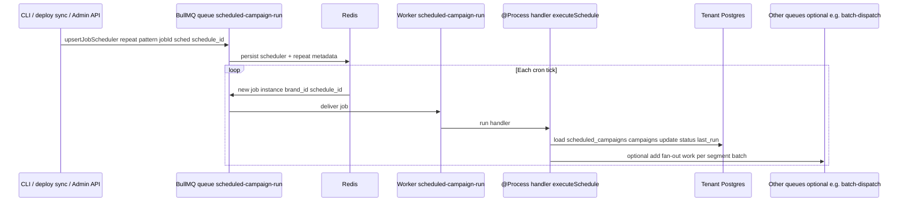

# Architecture changes: journeys & scheduled campaigns (queue-driven)

This document describes **what must change** in **GammaEngage** to evolve **scheduled campaigns** and **journeys** from **in-process Nest timers + synchronous execution** toward **BullMQ-backed scheduling and execution**, while keeping **tenant Postgres** as the source of truth for definitions and state.

It is a **requirements / architecture** spec for engineering; it does not assume BullMQ is already merged.

**Related:** [reliable-background-work-evolution.md](./reliable-background-work-evolution.md) (principles, fairness, outbox), [reliable-background-work-evolution.md §8](./reliable-background-work-evolution.md#8-bullmq-target-flows-diagrams) (Mermaid flows), [workflow-engine-campaign-journey-flow.md](./workflow-engine-campaign-journey-flow.md), [background-jobs-bullmq.md](./background-jobs-bullmq.md).

**Code today (reference):** `SchedulerService` (`cdp-app` campaign-engine), `JourneyExecutorService`, `JourneyService`, entities `scheduled_campaigns`, `journey_enrollments`, `journey_steps`.

---

## 1. Goals

| Area | Problem today | Target |
|------|----------------|--------|
| **Scheduled campaigns** | `cron` + `setTimeout` live **in memory** per `cdp-app` instance; **reload on startup** only; scaling replicas does not distribute work safely; long `executeSchedule` blocks the timer callback | **Register** one-off / repeatable **wake-ups in BullMQ**; **workers** run `executeSchedule` (or extracted use case) with **retries**, **timeouts**, **dedupe** |
| **Journeys** | `JourneyExecutorService` **polls every minute** all due `journey_enrollments` in-process; overlap guarded by a **single boolean**; wait semantics tied to polling granularity | **Enqueue** `journey-advance` jobs **immediately** or with **delay** from `delay_hours` / `next_step_at`; optional thin cron only for **reconciliation** |

Cross-cutting: **idempotency**, **observability** (`brand_id`, schedule id, enrollment id), **fairness** across tenants (see parent doc).

---

## 2. Current architecture (baseline)

### 2.1 Scheduled campaigns

- Data: **`scheduled_campaigns`** (`cron_expr`, `run_at`, `is_active`, `status`, `segment_filter`, …).
- **`SchedulerService`** on **`onModuleInit`**: connects AMQP, calls **`reloadAllCronJobs()`** — iterates **active brands**, loads active schedules, for each row with **`cron_expr`** calls **`registerCronJob`** (in-memory **`cron.CronJob`**), else future **`run_at`** uses **`setTimeout`**.
- Create/update schedule paths call the same registration helpers so timers update.
- **`executeSchedule`** loads schedule + campaign, sets **`running`**, **`dispatchToPlayers`** (segment query + AMQP publish), then sets **`pending`** (cron) or **`completed`** (one-shot) or **`failed`**.

**Implication for change:** any move to BullMQ must **replace** the **`jobs` Map** + **`CronJob` / `setTimeout`** lifecycle, not duplicate it. **Multi-pod** deployments currently risk **duplicate** cron callbacks unless only one pod runs schedulers (not enforced in code reviewed here).

### 2.2 Journeys

- Definitions: **`journeys`**, **`journey_steps`** (`step_type`: send / wait / condition, `delay_hours`, …).
- Runtime: **`journey_enrollments`** (`current_step`, `next_step_at`, `status`).
- Entry: **`JourneyService.enrollFromEvent`** (from **`EventConsumerService`**) or APIs.
- Advancement: **`JourneyExecutorService`** `@Cron(EVERY_MINUTE)` → **`processDueEnrollments`** → per-enrollment **`processEnrollment`**.

**Implication for change:** minute tick is the main lever to replace with **delayed + immediate** queue jobs.

---

## 3. Shared platform changes (both features)

These are **one-time** platform tasks; both journeys and schedules depend on them.

1. **Redis connection for BullMQ** — Reuse or split from cache/throttler Redis (dedicated **key prefix** recommended).
2. **Nest module** — e.g. `@nestjs/bullmq` `BullModule.forRootAsync` + **`registerQueue`** for:
   - `scheduled-campaign-run`
   - `journey-advance`
   - (optional) `campaign-events` / `journey-on-event` if event path splits (see workflow doc).
3. **Workers** — `@Processor` classes or dedicated worker process; configure **concurrency**, **lock duration**, **stalled** job handling.
4. **Graceful shutdown** — **`onModuleDestroy`**: close workers/queues so in-flight jobs complete or stall-retry cleanly.
5. **Configuration** — Env for Redis URL, prefix, global concurrency, per-queue limits, feature flags **`USE_BULLMQ_SCHEDULER`**, **`USE_BULLMQ_JOURNEY`** for phased rollout.

---

## 4. Scheduled campaigns — required changes

### 4.1 Remove or bypass in-process scheduling

- **Stop** relying on **`Map<string, CronJob>`** + **`setTimeout`** for production scheduling (keep behind flag during migration).
- **`onModuleInit`**: instead of **`reloadAllCronJobs`** registering timers, **sync BullMQ repeatable / delayed jobs** from DB (or enqueue a **“reconcile schedules”** job that diffs DB vs Redis).

### 4.2 Registration API (when DB row changes)

On **create / update** of `scheduled_campaigns` (and on **activate / deactivate**):

| DB state | BullMQ action |
|----------|----------------|
| **`cron_expr` set**, active | **Upsert repeatable** job: pattern = `cron_expr`, stable **`jobId`** e.g. `sched:{schedule_id}`, payload `{ brand_id, schedule_id }` |
| **`run_at` only** (no cron), future, active | **Single delayed** job: `delay = run_at - now`, same payload, **`jobId`** e.g. `sched-once:{schedule_id}` |
| **Inactive** or deleted | **Remove** repeatable job / **obliterate** delayed job for that `jobId` |

**Required code touchpoints:** wherever **`registerCronJob` / `scheduleOneShot`** are invoked today (scheduler service + any HTTP handlers), add **BullMQ upsert/remove** side effects.

### 4.3 Execution path

- Move **`executeSchedule`** body (or call it unchanged) behind a **BullMQ processor** for queue **`scheduled-campaign-run`**.
- **Do not** run heavy segment + AMQP work inside a **thin** cron; the **job** carries **`schedule_id`** + **`brand_id`** (and optional **`run_id`** if outbox added).
- **Retries:** BullMQ attempts for transient AMQP/HTTP failures; **non-retryable** business failures should still set **`scheduled_campaigns.status = failed`** once.

### 4.4 Idempotency & duplicate fires

- **Per fire:** insert or claim an outbox row **`scheduled_campaign_runs`** with unique **`(schedule_id, fire_window_start)`** or **`run_id`** before dispatch; or rely on **BullMQ jobId** per occurrence if using **one job per fire** for cron (repeatable jobs fire new job instances — define **dedupe** at worker start).
- Document chosen strategy in runbooks (see §5 in [reliable-background-work-evolution.md](./reliable-background-work-evolution.md)).

### 4.5 Observability

- Metrics: **job duration**, **failure rate**, **players dispatched** per **`brand_id`** / **`schedule_id`**.
- Logs: include **`schedule_id`**, **`campaign_id`**, **`brand_id`**, BullMQ **job id**.

### 4.6 Optional schema

- **`scheduled_campaign_runs`** (pending → running → done/failed) for audit and **replay** if Redis is lost.

### 4.7 Sequence: schedule registration → each run (BullMQ)

Same shape as a **CLI / deploy script** registering a repeatable scheduler: something **upserts** the BullMQ scheduler; **Redis** stores metadata; on each pattern match a **new job instance** hits the **worker** `@Process` handler, which may **fan out** to other queues instead of doing all work inline.

**Repeatable (`cron_expr`):** use BullMQ’s **repeatable / job scheduler** API (e.g. **`upsertJobScheduler`** on the queue, BullMQ 5+) with a stable **`jobId`** per `schedule_id`. **One-off (`run_at`):** use **`Queue.add`** with **`delay`** (and a stable **`jobId`** for `sched-once:{id}`) instead of a repeat scheduler.

**Reading it**

- **CLI / API** is any writer that reacts to **DB changes** or **release deploy** (sync all schedules from tenant DBs).
- **`scheduled-campaign-run`** is both where you **register** the scheduler (queue API) and where **runnable jobs** land for workers (same queue name in typical BullMQ setups).
- **`OQ`** is optional: e.g. one job per **N players** for backpressure, or keep today’s model and publish **directly to AMQP** inside **`H`** until you split.

---

## 5. Journeys — required changes

### 5.1 Replace (or drastically narrow) the minute executor

- **`JourneyExecutorService`**: either **remove** `@Cron` or reduce it to **reconciliation** (e.g. scan enrollments with **`next_step_at`** older than X and missing a queued job — rare edge cases).
- Primary driver becomes **`journey-advance`** jobs.

### 5.2 On enrollment

When **`journey_enrollments`** is created (`tryEnroll` / API):

1. Compute **first step** due time from **`journey_steps`** (`delay_hours` for step 1, etc.) into **`next_step_at`** (already persisted today).
2. **Enqueue** `journey-advance` with **`delay = max(0, next_step_at - now)`**, payload `{ brand_id, enrollment_id, expected_step }`, **`jobId`** stable per step boundary e.g. `jrny:{enrollment_id}:step:{current_step}` to avoid duplicates.

### 5.3 On each advance (worker)

Processor should:

1. Load enrollment **by id**; verify **`status === active`** and **`current_step`** matches **expected** (guard stale jobs).
2. Load ordered **`journey_steps`**; execute **send / condition / wait** same semantics as **`processEnrollment`** today.
3. **After** a successful step:
   - **send / condition success:** advance **`current_step`**, set **`next_step_at`** for following step’s delay; if no next step → **`completed`**.
   - **wait step:** only updates timestamps and schedules **next delayed** `journey-advance`.
   - **condition fail:** **`exited`**, **no** follow-up job.
4. **Enqueue** the **next** `journey-advance` (immediate or delayed) unless terminal.

### 5.4 Idempotency

- **`jobId`** per **`(enrollment_id, step_order, attempt_window)`** or DB **unique constraint** on processed step transitions.
- Replays of the same job must **not** double-publish journey sends.

### 5.5 Event-driven entry (optional tightening)

- Today **`enrollFromEvent`** runs **inline** in **`EventConsumerService`**. Optional improvement: enqueue **`journey-on-event`** after player state update (see [workflow-engine-campaign-journey-flow.md §5](./workflow-engine-campaign-journey-flow.md#5-event-arrives--active-journeys-bullmq)) so enrollment + first **advance** happen under **queue retries**.

### 5.6 Observability

- Metrics: **advance latency**, **failures**, **count active enrollments** per brand.
- Logs: **`enrollment_id`**, **`journey_id`**, **`current_step`**, **`brand_id`**.

---

## 6. Deployment & operations

- **Single scheduler sync:** decide which component **registers** repeatable schedule jobs (only **one** logical writer, or idempotent upserts from every pod if safe).
- **Workers:** can run **inside** `cdp-app` initially; move to **worker-only** replicas when CPU/memory separation is needed.
- **Redis loss:** schedules can be **re-synced** from DB; journey **timers** may need **reconciliation cron** to re-enqueue missing jobs if Redis drops delayed jobs (mitigated by **outbox** or **next_step_at** scan).

---

## 7. Suggested rollout phases

| Phase | Scheduled campaigns | Journeys |
|-------|---------------------|----------|
| **A** | Add BullMQ + queue; worker calls `executeSchedule`; feature flag off | Add `journey-advance` queue + worker; flag off |
| **B** | Flag on: register jobs on write + startup sync; disable in-memory cron | Flag on: enqueue on enroll + step; reduce cron to reconciliation |
| **C** | Add run/outbox table + metrics | Same + journey metrics |
| **D** | Per-tenant concurrency / fairness tuning | Same |

---

## 8. Summary checklist

**Scheduled campaigns**

- [ ] BullMQ queues + worker for `scheduled-campaign-run`
- [ ] Replace `CronJob` / `setTimeout` with repeatable + delayed registration
- [ ] Hooks on schedule CRUD for upsert/remove Redis jobs
- [ ] Idempotency strategy per fire
- [ ] Metrics and structured logs

**Journeys**

- [ ] BullMQ queue + worker for `journey-advance`
- [ ] Enqueue on enrollment + after each non-terminal step (delayed where needed)
- [ ] Deprecate or shrink `JourneyExecutorService` cron
- [ ] Idempotency for send steps
- [ ] Metrics and structured logs

**Shared**

- [ ] Redis, Nest Bull module, shutdown hooks, env flags, runbooks

---

*Document version: internal architecture note for `cdp-app` campaign-engine journey + scheduler domains.*
