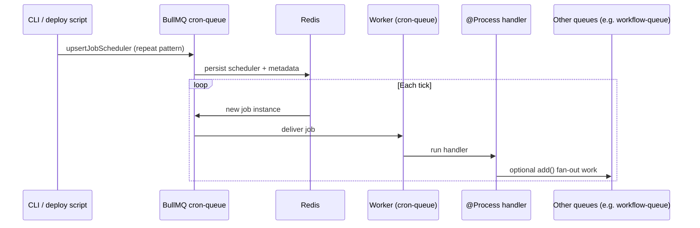

# Enhancement: BullMQ for scheduled campaigns

This document describes how we intend to integrate **BullMQ** (on **Redis**) into GammaEngage so **scheduled campaigns** are driven by a **durable job scheduler** instead of **in-process** `node-cron` timers and `setTimeout` in the campaign-engine `SchedulerService`.

**Status:** enhancement / target architecture. Today, active schedules are loaded from tenant **`scheduled_campaigns`** rows and registered in memory on `onModuleInit`; see `cdp-app/src/services/campaign-engine/src/scheduler/scheduler.service.ts`. BullMQ wiring is specified in internal docs such as `docs/journey-scheduled-campaign-architecture-changes.md` and `docs/background-jobs-bullmq.md`.

---

## Why this change

| Today | With BullMQ |
|--------|-------------|
| Each API replica can run the same cron unless operations constrain replicas | **Repeat schedulers** and **job instances** are coordinated via **Redis**; workers scale horizontally |
| Timers are **lost on restart** until `reloadAllCronJobs` runs; no built-in retries | Jobs **persist** until completed/failed; **retries**, backoff, and stall handling are first-class |
| Long `executeSchedule` (segment fetch + AMQP) runs inside a timer callback | Thin **@Process** handler can **fan out** to dedicated queues for heavy or parallel work |

---

## Mental model

1. **Source of truth** — Tenant Postgres **`scheduled_campaigns`** (`cron_expr`, `run_at`, `is_active`, …) remains authoritative for *what* should run.
2. **Registration** — On create/update/activate/deactivate (and on deploy **reconcile**), the app or a **CLI / deploy script** updates BullMQ so Redis reflects the DB:
   - **Recurring:** stable job key per schedule, **repeat** pattern from `cron_expr` (BullMQ 5+ **job scheduler** APIs such as **`upsertJobScheduler`** on the campaign cron queue).
   - **One-shot:** delayed **`add()`** with `delay = run_at - now` and a stable **`jobId`** (e.g. `sched-once:{id}`), not a repeat scheduler.
3. **Execution** — A **worker** bound to the **cron / scheduler queue** runs the **`@Process`** handler, which loads the schedule, marks state, and either runs dispatch inline or **`add()`**s work to **other queues** (e.g. **`scheduled-campaign-run`**, **`journey-advance`**, workflow-style queues) for backpressure and observability.

---

## Sequence: scheduler registration → each tick → handler → optional fan-out

The flow below matches BullMQ’s model: something **registers** a repeatable scheduler on a queue; **Redis** stores scheduler metadata; on each match BullMQ **materializes a new job**; a **worker** runs the **Nest `@Process` (or equivalent) handler**, which may enqueue downstream jobs.

**Mapping to scheduled campaigns**

- **CLI** — Admin API or bootstrap / **reconcile** job after deploy: sync DB rows to BullMQ (not only a literal shell script).
- **cron-queue** — A dedicated queue used for **repeat / scheduler** traffic (name TBD; e.g. align with `scheduled-campaign-run` or split a thin **`scheduled-campaign-tick`** from a heavier execution queue).
- **Handler** — Invokes the same business logic as today’s **`executeSchedule`** (load `ScheduledCampaignEntity` + campaign, segment resolution, RabbitMQ publish to `ge.campaigns.outbound`), with **idempotency** per fire window where needed.
- **Other queues** — Optional **`add()`** fan-out: per-tenant batches, journey steps, or workflow jobs so the cron handler stays small and failures are isolated.

---

## Related documentation

- `docs/journey-scheduled-campaign-architecture-changes.md` — DB → BullMQ mapping table, queue names, feature flags.
- `docs/background-jobs-bullmq.md` — Rationale vs Nest `@Cron`.
- `docs/reliable-background-work-evolution.md` — Broader “scheduler vs executor” pattern.
