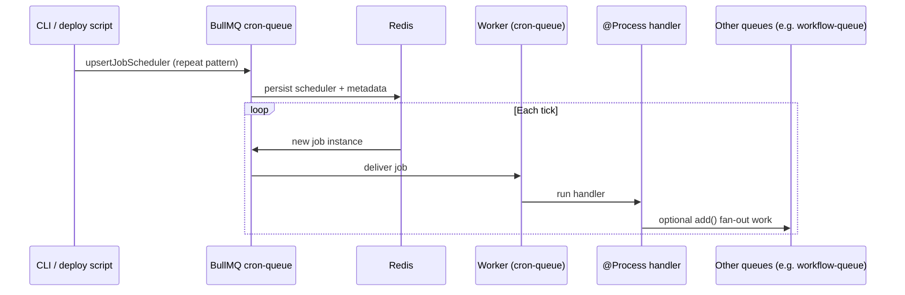
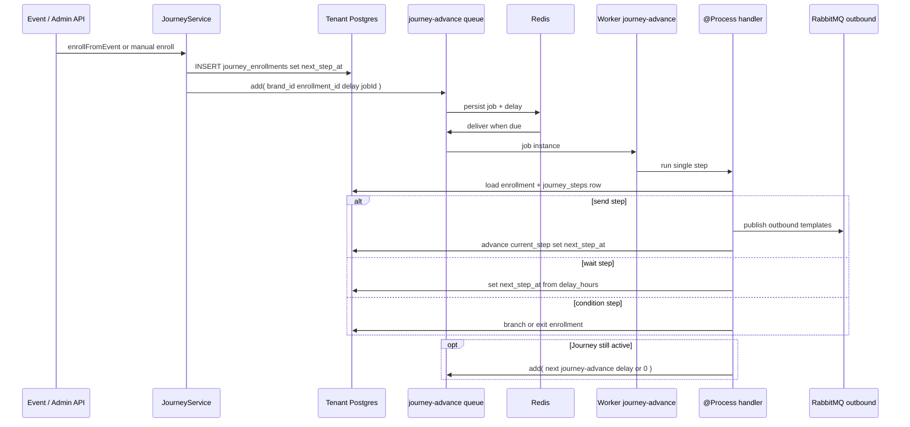

# Enhancement: BullMQ for scheduled campaigns & journey step execution

This document describes how we intend to integrate **BullMQ** (on **Redis**) into GammaEngage for:

1. **Scheduled campaigns** — replace in-process `node-cron` timers and `setTimeout` in **`SchedulerService`** with repeatable / delayed jobs.
2. **Journeys** — replace the **minute-wide** `JourneyExecutorService` cron that scans **`journey_enrollments`** with **per-enrollment** (or per-step) **`journey-advance`** jobs so each **step** runs when due, with retries and horizontal workers.

**Status:** enhancement / target architecture.

| Area | Code today (reference) |
|------|-------------------------|
| Scheduled campaigns | `cdp-app/src/services/campaign-engine/src/scheduler/scheduler.service.ts` — `reloadAllCronJobs`, `registerCronJob`, `scheduleOneShot`, `executeSchedule` |
| Journey steps | `cdp-app/src/services/campaign-engine/src/journey/journey-executor.service.ts` — `@Cron(EVERY_MINUTE)` → `JourneyService.processDueEnrollments` → `processEnrollment` |
| Journey enrollment | `JourneyService.enrollFromEvent` (e.g. from `EventConsumerService`) |

BullMQ wiring details: `docs/journey-scheduled-campaign-architecture-changes.md`, `docs/background-jobs-bullmq.md`.

---

## Why this change

| Today | With BullMQ |
|--------|-------------|
| Each API replica can run the same cron unless operations constrain replicas | **Repeat schedulers** and **job instances** are coordinated via **Redis**; workers scale horizontally |
| Timers are **lost on restart** until `reloadAllCronJobs` runs; no built-in retries | Jobs **persist** until completed/failed; **retries**, backoff, and stall handling are first-class |
| Long `executeSchedule` (segment fetch + AMQP) runs inside a timer callback | Thin **Nest Process** handler can **fan out** to dedicated queues for heavy or parallel work |
| Journey **`next_step_at`** only checked **once per minute**; `isRunning` skips overlapping ticks | **Delayed `add()`** aligns wake-up with `next_step_at`; no global “whole executor” lock for all tenants |

---

## Mental model

1. **Source of truth** — Tenant Postgres **`scheduled_campaigns`** (`cron_expr`, `run_at`, `is_active`, …) remains authoritative for *what* should run.
2. **Registration** — On create/update/activate/deactivate (and on deploy **reconcile**), the app or a **CLI / deploy script** updates BullMQ so Redis reflects the DB:
   - **Recurring:** stable job key per schedule, **repeat** pattern from `cron_expr` (BullMQ 5+ **job scheduler** APIs such as **`upsertJobScheduler`** on the campaign cron queue).
   - **One-shot:** delayed **`add()`** with `delay = run_at - now` and a stable **`jobId`** (e.g. `sched-once:{id}`), not a repeat scheduler.
3. **Execution** — A **worker** bound to the **cron / scheduler queue** runs the **`@Process`** handler, which loads the schedule, marks state, and either runs dispatch inline or **`add()`**s work to **other queues** (e.g. **`scheduled-campaign-run`**, **`journey-advance`**, workflow-style queues) for backpressure and observability.

### Journeys (step execution)

1. **Source of truth** — **`journey_enrollments`** (`current_step`, `next_step_at`, `status`), **`journey_steps`** (`step_type`: send / wait / condition, `delay_hours`, …).
2. **Wake-ups in Redis** — When an enrollment is created or a **send** / **condition** step finishes, compute the next eligible time. Instead of relying only on the next **cron** scan, **`Queue.add('journey-advance', { brand_id, enrollment_id }, { delay, jobId })`** (stable **`jobId`** per “next fire”, e.g. `journey:{enrollment_id}:{step}`) so BullMQ delivers the job when **`next_step_at`** is reached.
3. **Handler** — One **`@Process`** invocation runs **at most one step** for that enrollment: load enrollment + step definition, execute **send** (templates + AMQP to `ge.campaigns.outbound`), **wait** (persist `next_step_at`, enqueue delayed follow-up), or **condition** (branch / exit). On success, if the journey continues, **`add()`** the next **`journey-advance`** with the appropriate **`delay`** (or immediate if the next step is due now).
4. **Optional thin cron** — A low-frequency **reconcile** job (e.g. daily or every 15 minutes) can scan for **orphan** enrollments (Redis lost, missed delay) and re-`add()` — same idea as DB↔BullMQ sync for schedules.

---

## Sequence: scheduler registration → each tick → handler → optional fan-out

The flow below matches BullMQ’s model: something **registers** a repeatable scheduler on a queue; **Redis** stores scheduler metadata; on each match BullMQ **materializes a new job**; a **worker** runs the **Nest `@Process` (or equivalent) handler**, which may enqueue downstream jobs.



**Mapping to scheduled campaigns**

- **CLI** — Admin API or bootstrap / **reconcile** job after deploy: sync DB rows to BullMQ (not only a literal shell script).
- **cron-queue** — A dedicated queue used for **repeat / scheduler** traffic (name TBD; e.g. align with `scheduled-campaign-run` or split a thin **`scheduled-campaign-tick`** from a heavier execution queue).
- **Handler** — Invokes the same business logic as today’s **`executeSchedule`** (load `ScheduledCampaignEntity` + campaign, segment resolution, RabbitMQ publish to `ge.campaigns.outbound`), with **idempotency** per fire window where needed.
- **Other queues** — Optional **`add()`** fan-out: per-tenant batches, journey steps, or workflow jobs so the cron handler stays small and failures are isolated.

---

## Flow: journey step execution (target)

High-level control flow from **enrollment** through **queued steps** to **completion** or **exit**. Solid lines are the BullMQ-backed path; the dashed line is an optional safety **reconcile** tick.

```mermaid
flowchart TB
  subgraph Entry
    EV[Event / API]
    EN[JourneyService enroll / create enrollment]
  end

  subgraph Persistence
    DB[(Tenant Postgres journey_enrollments journey_steps)]
  end

  subgraph BullMQ
    JQ[journey-advance queue]
    RD[(Redis)]
    WK[Worker]
    PR[@Process handler one step]
  end

  subgraph outbound["Side effects"]
    MQ[RabbitMQ ge.campaigns.outbound]
  end

  EV --> EN
  EN --> DB
  EN -->|add job payload brand_id enrollment_id| JQ
  JQ --> RD
  RD -->|due| WK
  WK --> PR
  PR --> DB
  PR -->|send step| MQ
  PR -->|more steps: add with delay or immediate| JQ
  PR -->|completed or exited| DB

  RC[Optional reconcile cron] -.->|re-add if drift| JQ
  RC -.-> DB
```

---

## Sequence: journey advance job (per step)

Each **job** represents “run the current step for this enrollment once”. After a **wait** step, the handler updates **`next_step_at`** in Postgres and enqueues the **next** job with **`delay`**. Retries apply to transient failures (AMQP, HTTP) without blocking other enrollments.



**Idempotency note:** use a deterministic **`jobId`** (or DB claim row) so a duplicate **`add()`** after retry does not double-send the same step; document the chosen keying in runbooks (see `docs/journey-scheduled-campaign-architecture-changes.md` §4.4 pattern for schedules).

---

## Related documentation

- `docs/journey-scheduled-campaign-architecture-changes.md` — DB → BullMQ mapping table, queue names, feature flags.
- `docs/background-jobs-bullmq.md` — Rationale vs Nest `@Cron`.
- `docs/reliable-background-work-evolution.md` — Broader “scheduler vs executor” pattern.
