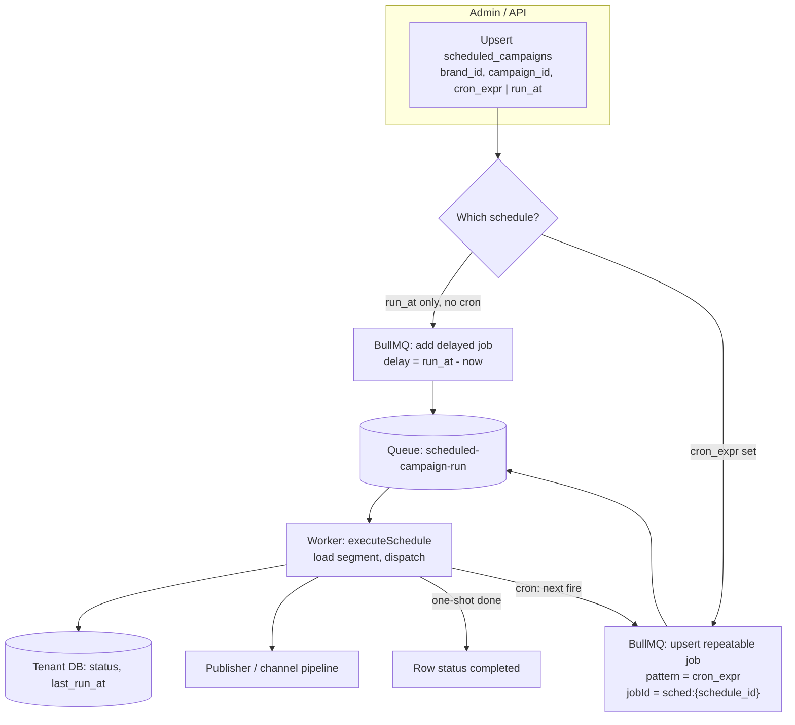
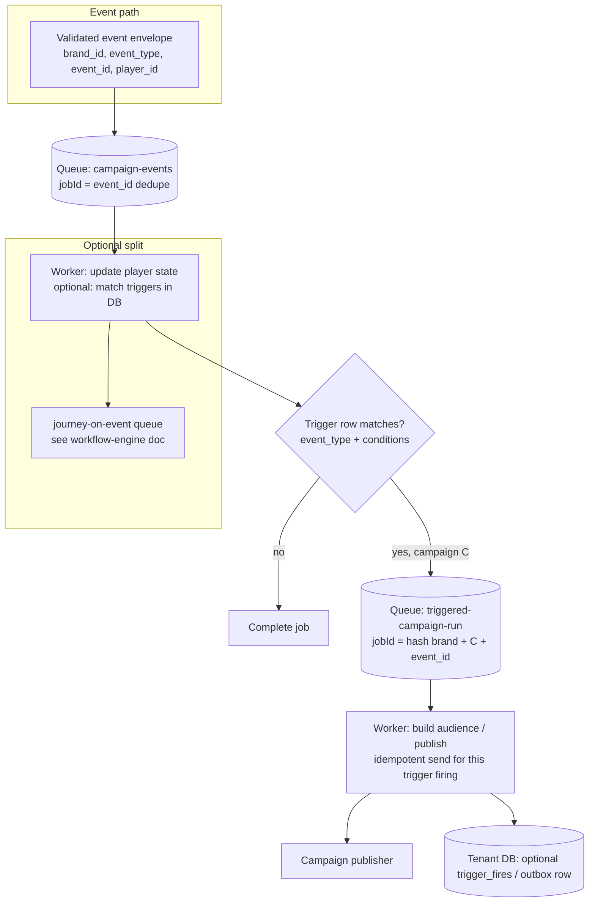
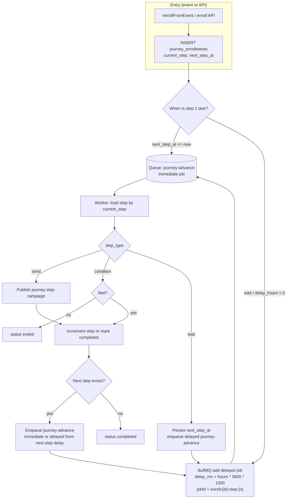

# Evolving background work: from Nest crons to queue-driven execution

This project’s setup — **Postgres per tenant** (or dedicated DB per tenant with fallback), **`@nestjs/schedule`** crons, and **synchronous DB work** in the monolith — is **valid**. The improvements below are **incremental** (“Twenty-style” in spirit: **reliability**, **scale**, and **clear boundaries** between *deciding that something should run* and *actually running it*). They are a **hybrid**, not a full rewrite.

**Goal:** crons and API paths become **schedulers**; a **job queue** (e.g. **BullMQ** on existing **Redis**) becomes the **executor**, with **idempotent runs**, **backpressure**, and **observability**.

Related docs: [background-jobs-bullmq.md](./background-jobs-bullmq.md), [workflow-engine-campaign-journey-flow.md](./workflow-engine-campaign-journey-flow.md).

---

## 1. A real job queue (BullMQ or similar) — hybrid, not a rewrite

**Keep** lightweight crons (e.g. every minute): they **only scan for due work** and **enqueue** small jobs with payloads such as `{ brand_id, schedule_id, run_id, … }` or `{ brand_id, enrollment_id, … }`.

**Workers** (same Nest process at first, or separate worker deployments later) **execute** campaigns, journey advances, retries, webhooks.

You gain:

- **Retries, backoff, timeouts** — a failed run does not block the cron tick or poison the whole process.
- **Horizontal scale** — add workers without **N** pods each running the same `@Cron`.
- **Less duplicate work** — overlapping cron runs are less likely to double-send if execution is **claimed** via queue **jobId** / DB row (see §3 and §5).

**Principle:** crons become **schedulers**; the **queue** is the **executor**.

---

## 2. Delayed and scheduled jobs

Campaign sends, **journey `wait`** steps, and one-shot **`run_at`** schedules are naturally **“run at T”** or **“after N hours”**.

Prefer **BullMQ delayed jobs** and **repeatable / cron-pattern jobs** (or a tiny dedicated scheduler service) over **polling every tenant DB every minute** for every possible wake time.

- **Tenant DB** remains the **source of truth** for definitions and enrollment state.
- **Redis / BullMQ** holds **when** to wake a worker to act on that state.

---

## 3. Idempotency and deduplication keys

Events, webhooks, and segment triggers often **arrive twice**. Add:

- A **stable idempotency key** per logical run, e.g. `brand_id` + `campaign_id` + `trigger_event_id`, or `brand_id` + `enrollment_id` + `step_order` + window.
- Enforcement via **DB unique constraint** on a `run` / `job` row, **Redis SETNX**, and/or BullMQ **`jobId`** so the same trigger does not start **two** runs.

Keep keys **tenant-aware** (`brand_id` in the key and in queue names or prefixes where useful).

---

## 4. Fairness across tenants

With **one DB per tenant**, a **noisy brand** can still starve others if **one global worker pool** always picks their jobs first.

Mitigations:

- **Per-tenant queues** or **per-tenant concurrency limits** on a shared queue.
- **Rate limits** (sends per second, ESP API budgets) as **first-class limits in the worker**, not only implied by SQL batch size.

---

## 5. Outbox or “pending work” table per tenant

Instead of **only** “cron reads everything and decides”:

1. Triggers / API paths **insert** rows such as `campaign_runs` or `journey_jobs` with status **`PENDING`** (and the idempotency key).
2. A cron or queue consumer **claims** rows with **`FOR UPDATE SKIP LOCKED`** (or equivalent), sets **`RUNNING`**, and **enqueues** the BullMQ job with the row id.
3. On success / failure, move to **`DONE`** / **`FAILED`** with error metadata.

Benefits: **audit trail**, **replay**, safe restarts if **Redis is cleared** (work can be re-derived from DB + stale job recovery).

---

## 6. Observability

Add **structured logs** and **metrics** tagged by **`brand_id`**, **campaign**, **journey**, **step**, **queue name**: duration, failures, **queue depth**, retry count.

Crons alone make it hard to see **which tenant** failed or saturated the system; queue-backed work surfaces that naturally in dashboards and alerts.

---

## 7. Optional later: workflow engine shape

If journeys grow **branches, long waits, A/B splits, compensation**:

- Keep a **small state machine** in the **tenant DB**: current step + **context JSON**.
- Prefer **one job = advance one step** (or one **bounded batch**), i.e. explicit **run / resume** boundaries, without adopting a second workflow product.

You **do not** need: a separate workflow SaaS, GraphQL rewrites, or **schema-per-tenant** for this. **Per-tenant DB** already gives **strong isolation**; the main gap versus Nest-only crons is usually **async execution**, **backpressure**, and **deduplication**. **Queue + idempotent runs + bounded workers** closes most of that gap with **smaller change** than a full redesign.

---

## 8. BullMQ target flows (diagrams)

Shared queue name examples: `scheduled-campaign-run`, `triggered-campaign-run`, `journey-advance`. Use a **Redis key prefix** and **`jobId`** / **outbox** as in §3 and §5.

### 8.1 Scheduled campaign — one-off vs repeatable

When **`scheduled_campaigns`** is created or updated (`is_active`), the app **registers** the right BullMQ shape. **`cron_expr`** wins over **`run_at`** (same as today’s entity semantics).

**Implementation notes**

- **Repeatable:** one stable **`jobId`** per `schedule_id` so updates **replace** the repeat definition instead of stacking duplicates.
- **One-off:** single delayed job; on success mark **`completed`**; no repeat registration.
- **Hybrid cron + legacy row:** if you still persist `next_run` in DB, BullMQ is the **wake timer**; DB remains **audit** and **segment** source.

---

### 8.2 Triggers — same configured event → run campaign (BullMQ)

Goal: when an **event** matches **trigger configuration** (same `brand_id`, conditions, campaign), **enqueue** execution instead of doing everything synchronously in the event consumer.

**Implementation notes**

- **`triggered-campaign-run`** carries `{ brand_id, trigger_id, campaign_id, player_id, event_id }` (exact fields match your schema).
- **Dedupe** is critical: same event redelivered must not create **two** sends — **`jobId`** + DB unique on `(event_id, trigger_id)` or equivalent.
- **Heavy evaluation** (AI, large segments) can stay in **`campaign-events`** worker or move to **`triggered-campaign-run`** with **smaller** fan-out jobs per player batch.

---

### 8.3 Journey — `run_at` / `wait` / `next_step_at` via BullMQ

Replace **minute cron polling** of **`journey_enrollments`** with **explicit delayed jobs** for “wake at T”, and **immediate jobs** for steps that run now. **Completion** is when there is **no next step** after a successful advance.

**Mapping to current model**

- **`delay_hours`** on **`journey_steps`** → BullMQ **`delay`** on the **next** `journey-advance` job (same as a **`wait_till`** / **`run_at`** for that step boundary).
- **`next_step_at`** in DB stays the **source of truth** for reporting; the **job** is the **timer** that wakes the worker.
- **Condition exit** does not enqueue a follow-up; **send** then **advance** enqueues the **next** job only if a row with higher **`step_order`** exists.

---

## Suggested migration order (summary)

| Order | Change | Leverage |
|------|--------|----------|
| 1 | Introduce BullMQ; crons enqueue only | High |
| 2 | Delayed / repeatable jobs for waits & schedules | High |
| 3 | Idempotency keys + constraints | High |
| 4 | Per-tenant fairness & rate limits | Medium–high under load |
| 5 | Tenant outbox / `PENDING` work tables | Medium (ops + replay) |
| 6 | Metrics & logs by tenant / campaign | Medium |
| 7 | Richer journey state machine + one-step jobs | When complexity hurts |

---

*Internal guidance for GammaEngage **cdp-app** and tenant Postgres. Adjust table names (`scheduled_campaigns`, `journey_enrollments`, …) to match implementation as outbox tables are introduced. Flow diagrams: **§8**.*

