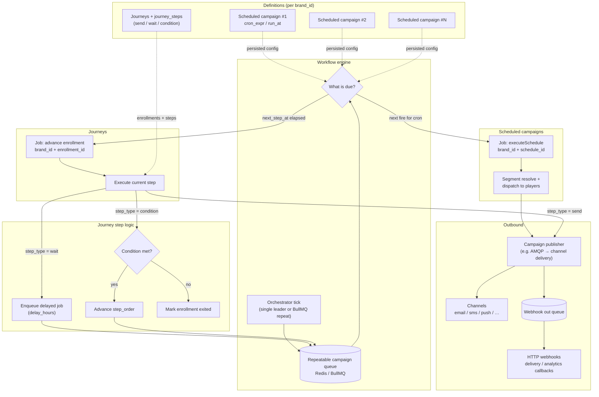
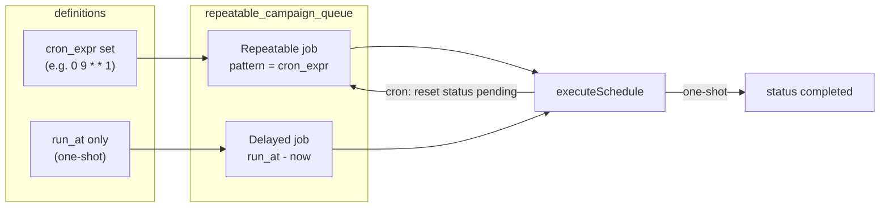
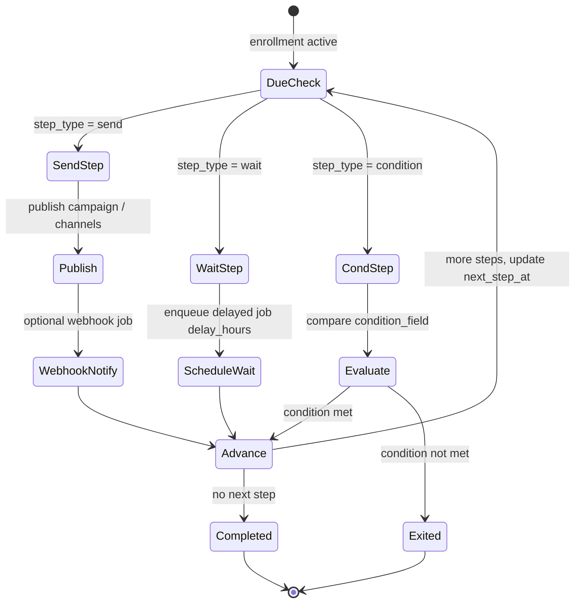
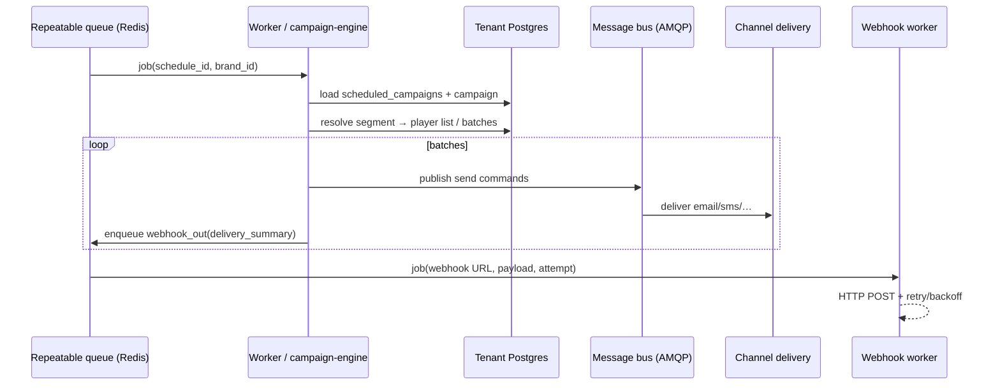
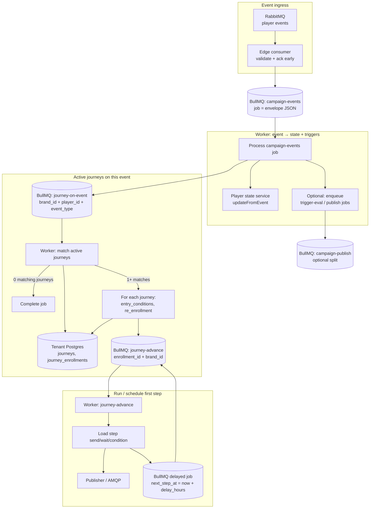
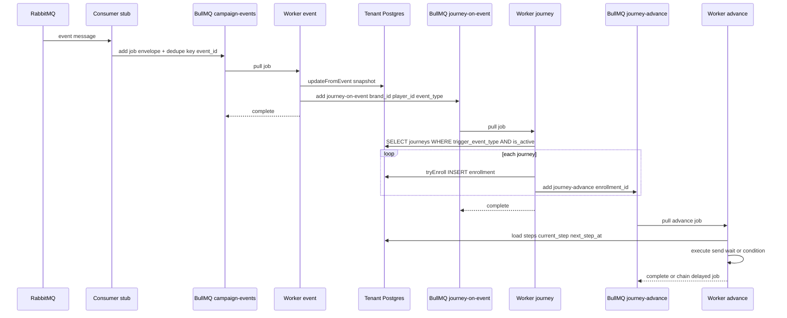

# Workflow engine: schedules, campaigns, journeys, webhooks

Conceptual flow diagrams for a **workflow engine** that coordinates **many scheduled campaigns** (cron or one-shot), a **repeatable campaign queue**, **journey steps**, and **outbound webhooks**. This aligns with ideas in **cdp-app** (`scheduled_campaigns`, `cron_expr`, journey enrollments / steps) and with a **BullMQ-style** orchestration layer described in [background-jobs-bullmq.md](./background-jobs-bullmq.md).

These diagrams are **target architecture**; wiring may use BullMQ flows, separate queues, or a mix.

---

## 1. End-to-end engine (schedules → campaigns → channels & webhooks)

High-level control plane: one **orchestrator** tick (or repeatable Redis job) fans out work without duplicating cron on every API replica.

**Reading the diagram**

- **Many schedules** map to **many repeatable jobs** (one job key per `schedule_id`, or one scanner job that loads all due rows from Postgres).
- **Journey** work is either the same tick scanning **`journey_enrollments`** (`status`, `next_step_at`) or **per-enrollment delayed jobs** after a **wait** step (cleaner than polling only on a minute cron).
- **Webhooks** are modeled as a **dedicated queue** so HTTP retries, backoff, and dead-lettering do not block campaign send or journey advancement.

---

## 2. Repeatable campaign queue vs one-shot

This mirrors **`ScheduledCampaignEntity`**: `cron_expr` takes precedence over `run_at`; after a successful cron run, schedule stays **pending** for the next occurrence.

---

## 3. Journey: steps as a small state machine

---

## 4. Optional: sequence — schedule fire to webhook

---

## 5. Event arrives → active journeys (BullMQ)

Today **cdp-app** handles this **inline** in **`EventConsumerService`**: after validating the envelope and updating player state, it calls **`JourneyService.enrollFromEvent`** (match **`journeys`** where **`trigger_event_type`** equals **`event_type`** and **`is_active`**, then **`tryEnroll`** with **`entry_conditions`** / **`re_enrollment`** rules).

The diagrams below show the **same semantics** with **BullMQ** so ingestion stays fast, retries are explicit, and many replicas do not double-run enrollment on the same message.

### 5.1 Architecture (queues and workers)

**Why split `campaign-events` and `journey-on-event`?**

- **Back-pressure** — High event volume does not block journey enrollment if journey workers scale independently.
- **Retries** — A failed **`tryEnroll`** retries the **journey** job without re-playing the full event pipeline (if you store **`event_id`** and enforce idempotency).
- **Optional** — Single queue is valid: one worker does state update + **`enrollFromEvent`** + trigger evaluation in one job (closer to current **`processMessage`**).

### 5.2 Sequence (happy path)

### 5.3 Idempotency keys (recommended)

| Job queue | Suggested `jobId` / dedupe input |
|-----------|-----------------------------------|
| `campaign-events` | `event_id` (envelope) so redelivery does not double-process |
| `journey-on-event` | `event_id` + `journey_id` or hash of `(brand_id, player_id, journey_id, event_id)` for **re_enrollment: always** semantics |
| `journey-advance` | `enrollment_id` + `current_step` + time window, or BullMQ **jobId** per step execution |

---

## 6. Implementation notes (short)

- **Idempotency** — Use stable **job ids** (`schedule_id` + fire window, or `enrollment_id` + `step_order`) so duplicates after deploy do not double-send.
- **Fan-out** — BullMQ **FlowProducer**: parent “run schedule” → children “batch 1…k” → optional “aggregate + webhook” child (see BullMQ flows docs).
- **Separation** — Keep **orchestration** (what runs when) in the workflow engine; keep **content** (templates, segments) in tenant DB; keep **HTTP webhooks** on an isolated queue with strict timeouts.
- **Event → journey** — Mirror **`enrollFromEvent`** + **`tryEnroll`** in **`journey-on-event`** workers; replace minute **`JourneyExecutorService`** ticks with **`journey-advance`** jobs (**immediate** + **delayed** after wait steps) where possible.

---

*See also: [background-jobs-bullmq.md](./background-jobs-bullmq.md), campaign-engine `EventConsumerService`, `JourneyService.enrollFromEvent`, `JourneyExecutorService`, `SchedulerService`, `JourneyStepEntity`.*
