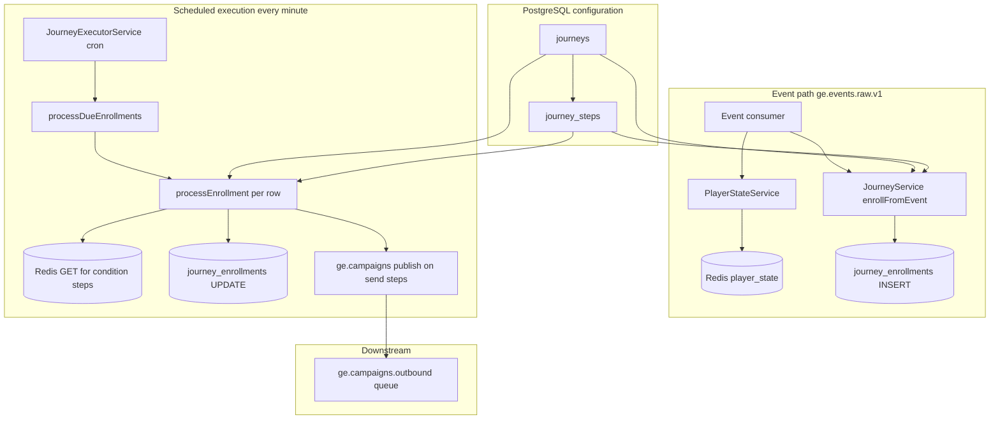
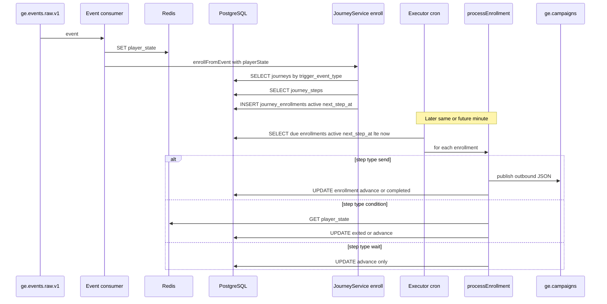

# Journeys: how they work, start, end, and what storage they use

This document describes **multi-step journeys** in campaign-engine: how they relate to **events** (similar to triggers, but separate), how **enrollment** starts and **completion** or **exit** ends, and **when** reads and writes happen on **PostgreSQL**, **Redis**, and **RabbitMQ**. The journey code path does **not** write to **ClickHouse**; ClickHouse may still receive the same **raw events** from the ingestion pipeline independently.

---

## 1. Concepts

### What is a journey?

A **journey** is a configured **sequence of steps** for a player: send a message, wait, branch on a **condition**, etc. Configuration lives in PostgreSQL:

- **`journeys`** — one row per journey: `trigger_event_type`, optional **`entry_conditions`**, **`re_enrollment`** policy, **`is_active`**.
- **`journey_steps`** — ordered steps (`send`, `wait`, `condition`) with delays and, for sends, **`campaign_id`** and **`channel`**.

### How is this like triggers?

| Aspect | Triggers | Journeys |
|--------|----------|----------|
| What starts it | `event_type` on **`triggers`** + conditions | `trigger_event_type` on **`journeys`** + optional **`entry_conditions`** |
| When evaluated | Same event consumer on **`ge.events.raw.v1`** | **`JourneyService.enrollFromEvent`** runs in that consumer **after** player state is updated |
| Outcome | Immediate campaign publish (per match) | **Enrollment** row + later steps via **cron** |
| Storage | `triggers` read-only at runtime; optional Redis sequences | **`journey_enrollments`** inserted/updated as the player moves through steps |

They are **parallel mechanisms**: one event can both **enroll** a player in a journey **and** fire **campaign triggers** for the same `event_type` if both are configured.

### Enrollment lifecycle (`journey_enrollments`)

| Status | Meaning |
|--------|---------|
| **`active`** | Player is in the journey; **`next_step_at`** schedules the next executor tick. |
| **`completed`** | All steps finished (no further step, or last step processed). |
| **`exited`** | Left early (failed **condition** step, or manual **exit** API). |

---

## 2. How a journey starts (enrollment)

**When:** An event is consumed from **`ge.events.raw.v1`**. In **`EventConsumerService.processMessage`**, order is:

1. Update **Redis** `player_state` (and return **`PlayerState`**).
2. Snapshot to PostgreSQL (async), conversions, etc.
3. **`JourneyService.enrollFromEvent(brandId, playerId, eventType, playerState)`** if journey module is present and `playerId` is non-empty.

**PostgreSQL reads**

- Load **active** journeys where **`brand_id`**, **`trigger_event_type`** match the event, **`is_active`**.

**Entry conditions**

- If **`entry_conditions`** is non-empty and **`playerState`** is provided, conditions are evaluated against **`PlayerState`** (same idea as trigger conditions on state fields). If they fail, **no enrollment** for that journey.

**Re-enrollment**

- **`never`**: if a row exists for `(journey_id, player_id)`, skip.
- **`after_exit`**: if an **active** enrollment exists, skip; otherwise may delete completed/exited row and re-enroll.
- **`always`**: delete existing enrollment row if present, then insert fresh.

**PostgreSQL writes**

- **`INSERT`** into **`journey_enrollments`**: `current_step = 1`, `status = active`, **`next_step_at`** = now + first step’s **`delay_hours`**.
- **`DELETE`** on **`journey_enrollments`** only when re-enrollment policy replaces an old row.

**Redis**

- No journey-specific write at enrollment. **`PlayerState`** was already written in step 1 for this event.

**Triggers in the same request**

- After enrollment, **`TriggerEvaluatorService`** runs; triggers are **not** required for the journey to enroll.

---

## 3. How steps run (executor)

**When:** **`JourneyExecutorService`** runs a **cron** every **minute** (`@Cron`).

**PostgreSQL reads**

- Find **`journey_enrollments`** where **`status = active`** and **`next_step_at` ≤ now**, ordered by **`next_step_at`**, limited to a batch (100).

For each due enrollment:

**PostgreSQL reads**

- Load all **`journey_steps`** for that **`journey_id`** in order.

**Per current step**

- **`send`** (with **`campaign_id`**): publish one message to **`ge.campaigns`** with routing **`campaigns.outbound.v1`** (same exchange/queue family as triggers). **`trigger_id`** in the payload is the **enrollment id** (not a trigger row uuid). This path does **not** go through **`CampaignPublisherService`** — so **no** automatic **`campaign_delivery_logs`** insert from journey code (unlike trigger-based **`publishCampaign`**).
- **`condition`**: read **Redis** key **`player_state:{brand_id}:{player_id}`**, evaluate **`condition_field` / `condition_op` / `condition_value`** against that JSON. If false → **`UPDATE`** enrollment **`status = exited`** and stop.
- **`wait`**: no side effect beyond advancing schedule (delay is on the **next** step’s **`delay_hours`** in the implementation flow).

**PostgreSQL writes (after handling the current step)**

- If there is **no next step**: **`UPDATE`** enrollment **`status = completed`**, clear **`next_step_at`**.
- Else: **`UPDATE`** **`current_step`** to the next step’s order, set **`next_step_at`** = now + that step’s **`delay_hours`**.

**Redis**

- **Read only** for **condition** steps (`GET` `player_state:…`). No journey-specific Redis keys.

**RabbitMQ**

- **Publish** on **`send`** steps only.

**ClickHouse**

- **Not used** by the journey module. Analytics pipelines that ingest **raw events** may still record the **triggering** event elsewhere.

---

## 4. How a journey ends

| End | What happens |
|-----|----------------|
| **Completed** | Last step processed; **`status`** set to **`completed`**; **`next_step_at`** cleared. |
| **Exited (condition)** | Condition step evaluates false; **`status = exited`**. |
| **Manual exit** | API **`exitPlayer`** → **`UPDATE`** **`status = exited`**. |
| **Missing step** | If **`current_step`** does not match any step row → **`completed`**. |

---

## 5. Storage summary

| Store | Journey role |
|-------|----------------|
| **PostgreSQL `journeys`, `journey_steps`** | **Configuration** (create/update via APIs). **Read** at enrollment and execution. |
| **PostgreSQL `journey_enrollments`** | **Runtime**: **INSERT** on enroll; **UPDATE** each time a step runs (advance or terminal status); **DELETE** when re-enroll replaces row. |
| **Redis `player_state:…`** | **Read** for **condition** steps. **Written** by the **event consumer** when **any** event arrives (before enrollment uses that state for **`entry_conditions`** in memory). |
| **RabbitMQ `ge.campaigns` / outbound queue** | **Publish** on each **`send`** step. |
| **ClickHouse** | **Not written** by journey services. Optional **raw event** pipeline is separate. |

---

## 6. Hierarchical diagram

---

## 7. Sequence diagram (enrollment + one step execution)

---

## 8. Step-by-step checklist (storage)

### On each raw event (if journeys enabled)

| Step | Action | PostgreSQL | Redis | RabbitMQ |
|------|--------|------------|-------|----------|
| 1 | Merge event into player state | — | **WRITE** `player_state` | — |
| 2 | `enrollFromEvent` | **READ** journeys, steps; **INSERT** enrollment (or skip/delete per policy) | — (entry uses **in-memory** `playerState`) | — |

### Every executor minute (due enrollments)

| Step | Action | PostgreSQL | Redis | RabbitMQ |
|------|--------|------------|-------|----------|
| 1 | Load due **`active`** enrollments | **READ** | — | — |
| 2 | Load steps for journey | **READ** | — | — |
| 3 | **`send`** step | **UPDATE** enrollment after advance/complete | — | **PUBLISH** |
| 4 | **`condition`** step | **UPDATE** exited or advance | **READ** `player_state` | — |
| 5 | Advance or complete | **UPDATE** `current_step`, `next_step_at`, or terminal **`status`** | — | — |

---

## 9. Relation to triggers (same event)

For one validated event, the consumer may:

1. Write **Redis** player state.
2. Insert or skip **journey** enrollment (**PostgreSQL**).
3. Evaluate **triggers** and **publish** trigger-based campaigns (**PostgreSQL** reads + optional **Redis** sequences + **RabbitMQ**).

Journeys do **not** insert **`triggers`** rows; **trigger** definitions are separate tables. **`event_type`** on the journey must **match** the incoming event’s **`event_type`** to enroll (via **`trigger_event_type`** on **`journeys`**).
