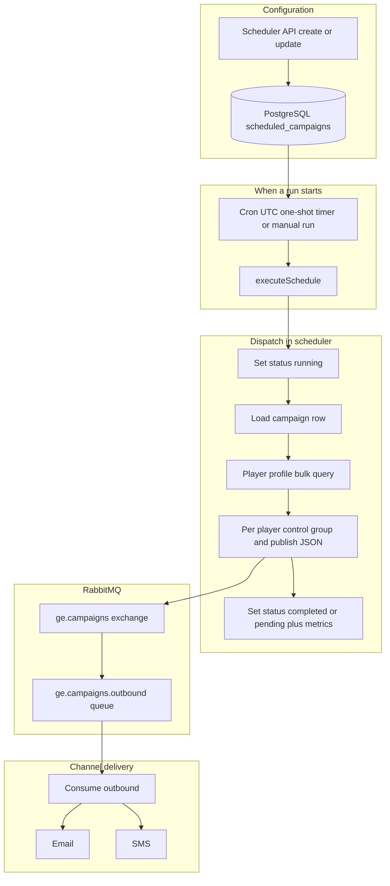
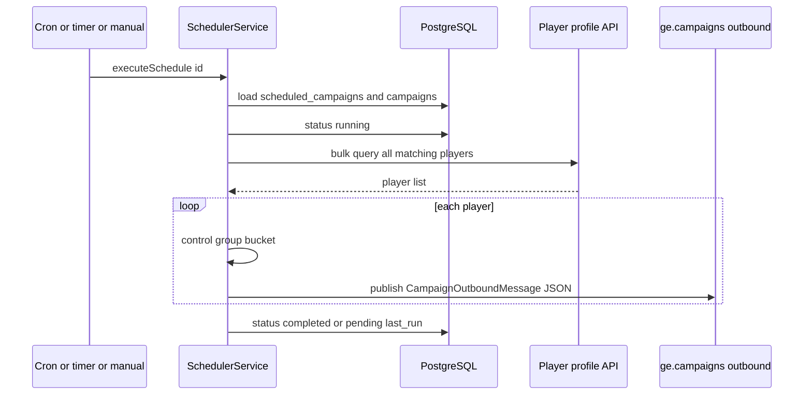

# Scheduled campaign execution: flow and storage

This document explains **how a scheduled (bulk) campaign run works** in campaign-engine: timers, recipient loading, control groups, what gets written to PostgreSQL and RabbitMQ, and how that differs from **event-triggered** campaigns. Scheduled definitions live in Postgres; each **run** walks many players and publishes one outbound message per player.

**Contrast:** Event-driven sends start from **`ge.events.raw.v1`**, evaluate **triggers**, and use **`CampaignPublisherService`** (A/B tests, delivery logs). Scheduled runs use **`SchedulerService`** only: they **do not** call that publisher and **do not** insert **`campaign_delivery_logs`** in the current implementation.

---

## 1. Mental model

1. A **schedule** row describes *when* to run and *which campaign* to send, plus optional **segment_filter** (passed to player-profile as opt-in flags).
2. **Cron** (UTC) or a **one-shot** `run_at`, or a **manual** “run now”, calls **`executeSchedule`**.
3. The service loads the **campaign**, marks the schedule **running**, loads **all matching players** from the **player-profile** bulk API, then publishes **one JSON message per player** to **`ge.campaigns`** with routing key **`campaigns.outbound.v1`** (same queue **`ge.campaigns.outbound`** as event-driven sends).
4. **Channel-delivery** consumes those messages the same way as trigger-based sends (email, SMS, control group skip, etc.).

### End-to-end flow (schedule → bulk query → outbound → channels)

---

## 2. What is stored: schedule and campaign rows

### Table `scheduled_campaigns`

Schedules are persisted in **PostgreSQL**. Typical fields:

| Field | Role |
|--------|------|
| `brand_id`, `campaign_id`, `name` | Link to the campaign and label |
| `segment_filter` | JSON; mapped to bulk query params such as `allow_email`, `allow_sms`, `allow_push` |
| `cron_expr` | Optional recurring schedule in **UTC**; if set, used instead of one-shot timing |
| `run_at` | Optional one-shot datetime |
| `status` | `pending`, `running`, `completed`, `failed`, `cancelled` |
| `last_run_at`, `last_run_count` | Updated after each successful run |
| `is_active` | If false, execution is skipped |

### Table `campaigns`

Each run **reads** the linked **`campaigns`** row for templates (`email_subject`, `email_html`, `sms_body`, …), **`channels`** (comma-separated, split into an array; default **`email`** if empty), **`control_group_pct`**, **`waterfall`**, and **`promo_code_id`**.

---

## 3. When execution starts

**On service startup (`onModuleInit`):**

1. Connect to RabbitMQ and assert the same **exchange** and **outbound queue** binding used elsewhere.
2. **Load all active schedules** and register **in-memory** jobs:
   - **`cron_expr` set** → `cron` job calling **`executeSchedule(schedule.id)`** on each tick.
   - **`run_at` in the future** (and no cron) → **one-shot** `setTimeout` to **`executeSchedule`**.

**On create or update:** The row is saved; cron or one-shot timers are **registered** or **refreshed** when active.

**Manual run:** Calling **run now** for a schedule id triggers **`executeSchedule`** immediately (same code path as cron).

---

## 4. Step-by-step: one scheduled run

### Step A — Preconditions

| Action | Storage |
|--------|---------|
| Load schedule by id; skip if missing or **`is_active`** false | **PostgreSQL read** **`scheduled_campaigns`** |
| Load **`campaigns`** by `campaign_id`; skip if missing or inactive | **PostgreSQL read** **`campaigns`** |

### Step B — Mark running

| Action | Storage |
|--------|---------|
| **`status = running`** | **PostgreSQL update** **`scheduled_campaigns`** |

### Step C — Resolve recipients

| Action | Storage |
|--------|---------|
| Build query from **`segment_filter`**: `brand_id` plus optional **`allow_email`**, **`allow_sms`**, **`allow_push`** | N/A |
| **Page through** player-profile **`/players/bulk`** until all players are loaded | **HTTP** to **player-profile** (not Postgres in campaign-engine) |

If no players match, dispatch returns **0**; the schedule row is still updated to success (see Step E).

### Step D — Publish one message per player

For **each** player returned:

| Action | Storage |
|--------|---------|
| **Control group:** deterministic hash of **`player_id`** and **`campaign_id`** vs **`control_group_pct`** (same idea as the publisher; **no** A/B test variant on this path) | N/A |
| Build payload: **`trigger_id`** like **`sched:{schedule_id}`**, **`event_type: scheduled`**, **`channels`** array from campaign, templates from campaign, **`is_control_group`**, **`dispatched_at`**, **`waterfall`** | N/A |
| **Publish** to **`ge.campaigns`**, routing **`campaigns.outbound.v1`** | **RabbitMQ** — one message per player, **including** control-group players (downstream skips real send when **`is_control_group`** is true) |

**Not done on this path:** **`CampaignPublisherService`**, **`AbTestService.assignVariant`**, **`ConversionTrackerService.logDelivery`**, so **no** **`campaign_delivery_logs`** rows from the scheduler.

### Step E — Finalize schedule row

| Action | Storage |
|--------|---------|
| On success: set **`last_run_at`**, **`last_run_count`** to dispatch count; **`status`** → **`pending`** if recurring **cron**, else **`completed`** for one-shot | **PostgreSQL update** **`scheduled_campaigns`** |
| On thrown error: **`status = failed`** | **PostgreSQL update** **`scheduled_campaigns`** |

---

## 5. Downstream: same outbound queue as triggers

**Channel-delivery** reads **`ge.campaigns.outbound`**, applies control-group suppression, throttle, contact resolution, templates, then **email**, **SMS**, push, etc. Behavior matches the event-triggered path for the same JSON shape.

---

## 6. Summary: storage and services on one scheduled run

| Store / system | What happens |
|----------------|----------------|
| **PostgreSQL** | **Read** schedule + campaign; **update** **`scheduled_campaigns`** (running → completed or pending or failed, metrics) |
| **PostgreSQL** | **No** insert to **`campaign_delivery_logs`** from scheduler path |
| **Redis** | **Not used** by the scheduler dispatch loop |
| **Player-profile** | **HTTP** bulk list of **`player_id`** values matching the filter |
| **RabbitMQ** | **Publish** N messages (N = bulk size), same exchange and routing as trigger-based sends |

**Event-triggered reminder:** Triggers, **`campaign_delivery_logs`**, Redis **`player_state`** / **`seq:`**, and **`CampaignPublisherService`** belong to the **raw event** pipeline, not to this bulk scheduler path.

---

## 7. Sequence diagram: one executeSchedule run

---

## 8. Comparison: scheduled run vs event trigger

| Aspect | Scheduled bulk run | Event trigger |
|--------|-------------------|---------------|
| Entry | Cron, one-shot, manual **`executeSchedule`** | Message on **`ge.events.raw.v1`** |
| Recipients | All players from bulk query | Single player from event |
| **`trigger_id`** | **`sched:{schedule_id}`** | Real trigger uuid |
| **`event_type`** | **`scheduled`** | From event envelope |
| A/B test assignment | Not used | **`AbTestService`** |
| **`campaign_delivery_logs`** | Not written by scheduler | Written when not control (publisher) |
| Redis **`player_state` / sequences** | Not updated | Updated per event |
