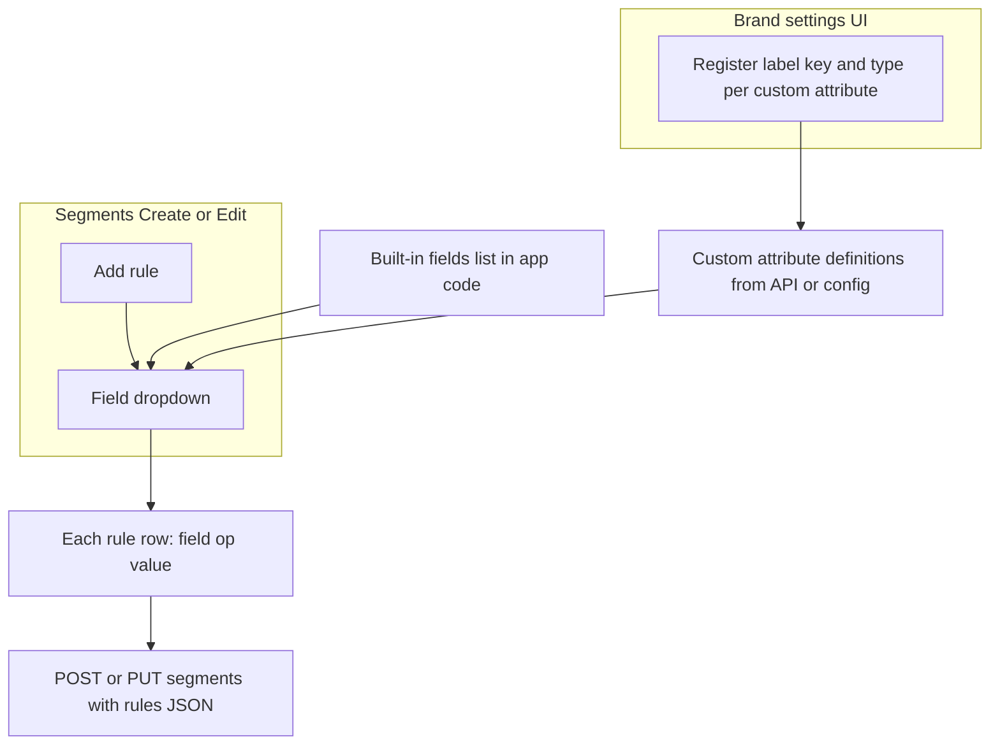
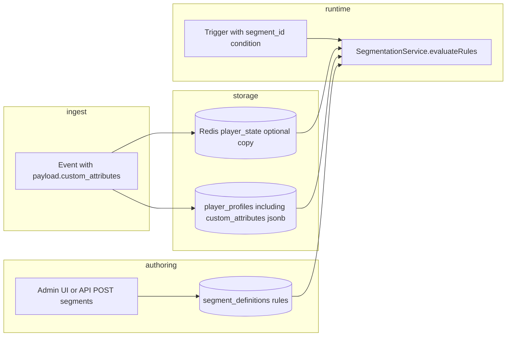

# Segmentation and `custom_attributes`

This document explains how **segments** are created and how they can use **`custom_attributes`**—flexible key-value data sent on events—so you can target players by game, product line, or any dimension your integration records.

**Reference implementation:** [Pull request #53](https://github.com/gammasweepai/gammaengage/pull/53) on `gammasweepai/gammaengage` (schema, profile merge, and segment evaluation). If your checkout differs slightly, treat the PR as the source of truth for field names and migrations.

---

## 1. Concepts

### What is `custom_attributes`?

Incoming events use a **`payload`** object (see the shared `EventEnvelope` schema: `payload` is an open `record`). Integrations often send a nested object:

```json
"payload": {
  "amount": 10,
  "custom_attributes": {
    "game_name": "Diamond Blitz",
    "spin_round": "a1b2c3d4"
  }
}
```

Keys under **`custom_attributes`** are **brand-defined** (game name, vertical, campaign tag, etc.). They are not part of the fixed core metrics (`deposit_count`, …) unless you map them there separately.

The **playground** in this repo shows the same idea: it builds `custom_attributes.game_name` (and optional `spin_round`) on synthetic events for testing.

### What is a segment?

A **segment** is a named rule set stored in PostgreSQL table **`segment_definitions`**:

- **`rules`**: JSON array of conditions, **AND**ed together.
- Each rule has **`field`**, **`op`** (`eq`, `neq`, `gt`, …, `contains`, `in`, …), and **`value`**.

Segments are created through the **campaign-engine API** (`POST /segments`) and usually through the **admin UI** (“Segments” → create/edit). Nothing is inferred automatically from events; operators **author** the rules explicitly.

---

## 2. Admin UI: custom attributes and the “Add rule” field dropdown

This is the **intended product flow** when you have a screen to manage custom attributes and segments: configured attributes **show up as choices** next to built-in fields whenever someone builds a rule.

### Step A — Define custom attributes (brand settings)

An operator opens a **brand-level** screen (name varies: “Custom attributes”, “Player dimensions”, “Segmentation fields”, etc.). There they **register** each attribute the brand cares about, for example:

| What the admin enters (conceptually) | What the system stores internally |
|-------------------------------------|-----------------------------------|
| Display label, e.g. “Favorite game” | Human-readable label for dropdowns |
| Internal key, e.g. `game_name` | Used under `payload.custom_attributes` and in rules |
| Data type (string, number, boolean, …) | Drives which **operators** are allowed (equals vs greater-than, etc.) |

That list is the **allow-list**: only these keys are valid for segmentation and for preview SQL. PR #53 or a small **tenant/brand config** service typically persists this (exact table or API name depends on the implementation).

### Step B — Build a segment: dropdown = built-ins + custom attributes

On **Segments → New segment** (or Edit), the user adds rules with **Add rule**. For each rule, the **Field** dropdown is built from **two sources merged into one list**:

1. **Built-in profile fields** — e.g. total deposit amount, country, lifecycle stage, allow flags, scores. These map to real columns on **`player_profiles`** (and to **`PlayerState`** where applicable).
2. **Custom attributes from Step A** — each entry appears with its **display label** (“Favorite game”) but when you save the rule, the **`field`** value written to the API is the **canonical rule path**, e.g. **`custom_attributes.game_name`**, not the label.

So: **you configure attributes once** in the settings UI; **they automatically appear** in the segment modal’s field picker—operators do not type JSON paths by hand.

### Step C — Operator, value, save

After choosing a field, the user picks an **operator** (`equals`, `contains`, …) and a **value**, consistent with the field’s type. **Preview count** (if shown) recalculates using the same rules. **Save** sends **`POST /segments`** or **`PUT /segments/:id`** with the **`rules`** array; each rule still has **`field` / `op` / `value`** as today.

### How this ties to events

Events continue to send **`payload.custom_attributes`** with keys that match the **internal keys** you registered (e.g. `game_name`). The profile pipeline merges those values so **preview** and **trigger-time** evaluation see the same data the segment rules describe.

### Implementation note (this repository)

In the **current** admin UI, **`CreateSegmentModal`** uses a **fixed** in-code list of fields (`FIELDS` in `CreateSegmentModal.tsx`) for the dropdown—there is **no** separate “custom attributes” settings screen wired in yet. The flow above is the **target UX**: once custom-attribute definitions are loaded from an API (or embedded in brand config), the UI should **`concat`** built-in fields with those definitions and render **one combined dropdown**. Until then, custom-attribute rules can still be created via **API** using **`field`** values like **`custom_attributes.<key>`**.

### Diagram: where the dropdown gets its options



---

## 3. Creating a segment (authoring flow)

1. **Choose brand and name** (and optional description).
2. **Add one or more rules.** Every rule must pass for a player to be **in** the segment.
3. **Save.** The API persists a row in **`segment_definitions`** with `rules` as JSONB.

**API shape** (conceptually):

- **`brand_id`**, **`name`**, optional **`description`**
- **`rules`**: `[{ "field": "...", "op": "eq", "value": "..." }, ...]`

**Optional preview:** `POST /segments/preview-count` sends draft **`rules`** and returns how many **`player_profiles`** rows match (used by the admin UI). For rules backed by SQL columns or JSON paths, the backend builds a **parameterized query**—see §6.

After save, the segment gets an **`id`** (UUID). Triggers can reference a **`segment_id`** condition so a campaign only fires for players who match that segment at evaluation time.

---

## 4. Referencing `custom_attributes` in rules

### Field naming convention

For a key that lives under `payload.custom_attributes` on events (and, after profile sync, on the player record), segment rules typically use a **single string field** that encodes the path, for example:

- `custom_attributes.game_name`
- `custom_attributes.favorite_slot`

That keeps one **`field`** string per rule while pointing at nested data. (Exact delimiter and nesting rules should match PR #53 and the evaluator in `SegmentationService`.)

### Operators

The same operators as for other segment fields apply: equality, numeric compares, **`contains`**, **`in` / `not_in`**, etc., depending on whether the value is string or number.

### Allow-listing (recommended)

Production systems usually **allow-list** which `custom_attributes` keys may appear in segment rules (validation on create/update). That avoids arbitrary JSON paths and keeps **preview SQL** and indexes manageable. PR #53 may introduce or extend this allow-list.

---

## 5. Data flow: from event to matchable profile

For **`custom_attributes`** to affect segmentation, values must be available where rules are evaluated:

1. **Ingest:** Events carry **`payload.custom_attributes`**.
2. **Profile merge (typical in PR #53):** Player-profile (or a consumer) **merges** the latest attributes into **`player_profiles.custom_attributes`** (or equivalent **jsonb** column), per brand and player.
3. **Real-time state (for triggers):** Redis **`player_state`** may also carry a flattened or nested copy so **`playerMatchesSegment`** can evaluate without a Postgres round-trip for every condition on the hot path.

Until those pieces exist in your deployment, rules that only read from **`PlayerState`** will not see keys that were never merged into state.

---

## 6. Preview count vs trigger-time evaluation

| Concern | Role |
|---------|------|
| **Preview count** | Counts rows in **`player_profiles`** matching the rules. Rules that use **`custom_attributes`** need a **jsonb** column (or generated columns) and safe SQL—typically `p.custom_attributes->>'game_name'` style predicates, with **field names validated** against an allow-list. |
| **Trigger evaluation** | For a **`segment_id`** condition on a trigger, **`SegmentationService.playerMatchesSegment`** loads the segment definition and evaluates **`evaluateRules`** against **`PlayerState`** from Redis. **`custom_attributes`** must be present on that state object (or the service must fall back to profile—depending on implementation in PR #53). |

If preview and runtime use different sources (Postgres vs Redis), they should stay **consistent** (same merge rules for events).

---

## 7. End-to-end diagram (conceptual)



---

## 8. Summary

| Piece | Purpose |
|-------|---------|
| **`payload.custom_attributes`** on events | Carries integration-specific dimensions per event. |
| **Player profile + optional Redis state** | Holds merged attributes for **preview** and **real-time** segment checks. |
| **`segment_definitions`** | Stores named **rules**; created via API/UI, not from events alone. |
| **Rule `field` values** like **`custom_attributes.game_name`** | Tie a rule to a nested attribute key. |
| **PR #53** | Intended reference for migrations, allow-lists, and evaluator behavior. |
| **Brand custom-attribute registry + segment Field dropdown** | See §2: settings define allow-listed keys; the **Add rule** dropdown merges **built-ins** and **custom** entries; saved rules still use **`custom_attributes.<key>`** paths. |

---

## 9. Related pieces in this repository (today)

- **Segment API:** campaign-engine **`SegmentationController`** under **`/segments`** (create/list/update/delete, preview count, match player).
- **Rule schema:** **`SegmentRuleDto`** — `field`, `op`, `value`.
- **Admin UI:** **Segments** page and **`CreateSegmentModal`** — the **Field** dropdown is currently a **fixed list** in code; §2 describes how **dynamic custom-attribute options** should populate that same dropdown once a brand settings API exists.
- **Playground:** `playground/index.html` — demonstrates **`custom_attributes`** on synthetic payloads for testing.

If anything in this doc disagrees with the merged PR #53, prefer the PR and the **`SegmentationService`** / **`player_profiles`** definitions on your branch.
