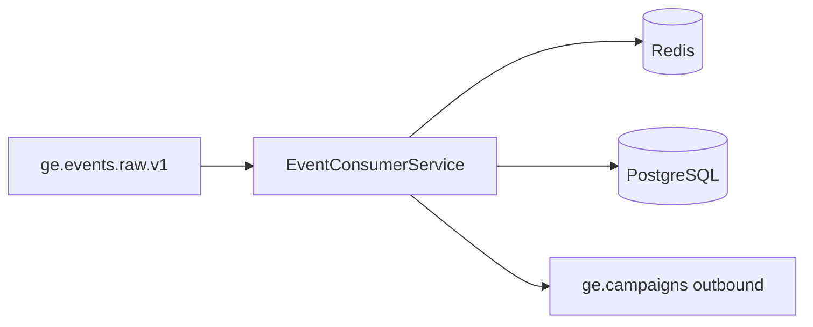
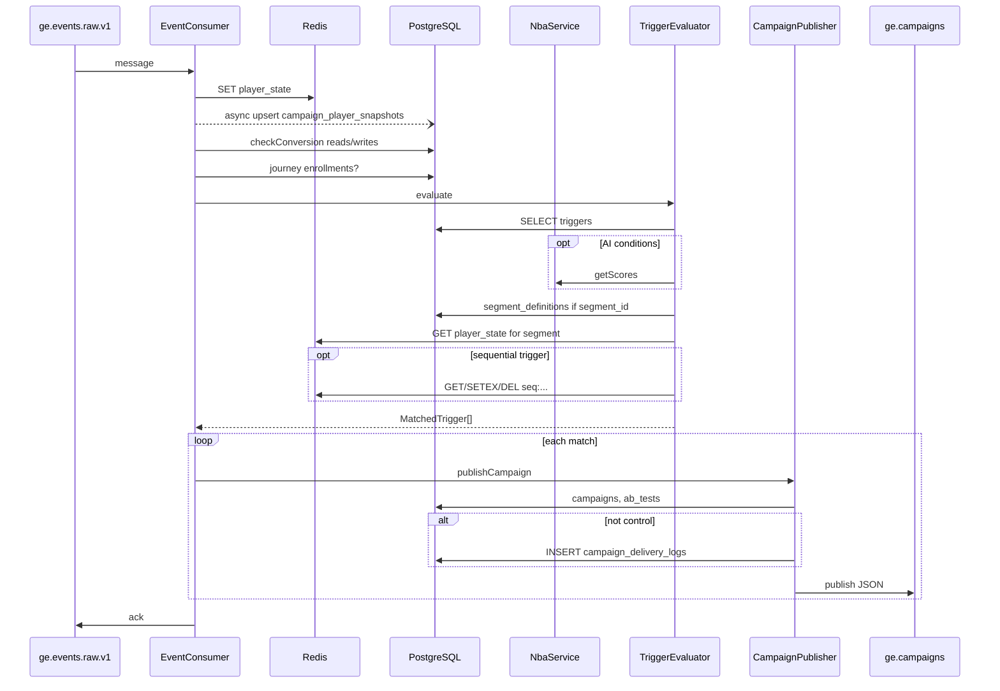

# From events to campaign triggers: flow and storage

This document explains **how incoming events lead to triggered campaigns** in Gamma Engage, and **what reads and writes** happen at each step—PostgreSQL, Redis, RabbitMQ, and external services. Trigger **definitions** are configuration in Postgres; they are **not** inserted when an event fires.

## 1. Mental model

1. An **event** describes something that happened for a player (deposit, login, bet, etc.).
2. **Triggers** tie an `event_type` (plus brand, conditions) to a **campaign** to send when rules pass.
3. The **campaign-engine** consumes events from RabbitMQ, **updates ephemeral and durable state**, then **evaluates** triggers and **publishes** outbound campaign messages for each match.

Runtime path (simplified):

---

## 2. Before campaign-engine (for context)

HTTP **event-ingestion** validates the envelope, enforces idempotency and rate limits, and publishes to **`ge.events.raw.v1`**. That phase touches **Redis** (idempotency, rate limits), **RabbitMQ**, and often **ClickHouse** for analytics. The separate end-to-end pipeline doc covers that ingest phase in detail.

The steps below start when **campaign-engine** consumes one message from **`ge.events.raw.v1`**.

---

## 3. Step-by-step: one consumed event in campaign-engine

Implementation entrypoint: `EventConsumerService.processMessage`.

### Step A — Parse and validate

| Action | Storage |
|--------|---------|
| `JSON.parse` + `validateEventEnvelope` (Zod) | None |
| Invalid envelope | **None** — message is logged and skipped (no Redis/PG updates for bad payloads) |

---

### Step B — Aggregated player state (Redis write)

| Action | Storage |
|--------|---------|
| `PlayerStateService.updateFromEvent` merges the event into rolling state via `reduceEventIntoState` | **Redis SET** key `player_state:{brand_id}:{player_id}` with **TTL 90 days** |

Player id comes from `external_player_id` or `visitor_id`. This state drives trigger conditions, segments, and snapshots. It is **not** written to Postgres in this step.

---

### Step C — Player snapshot (PostgreSQL, asynchronous)

| Action | Storage |
|--------|---------|
| `SnapshotService.upsertFromState(playerState)` — **fire-and-forget** (errors logged only) | **PostgreSQL** table **`campaign_player_snapshots`**: insert version 1 if none exists, else **update** the latest row in place (see `SnapshotService`) |

The main trigger path does **not** await this; it runs in parallel with later steps from the caller’s perspective (`.catch` on the promise).

---

### Step D — Conversion attribution (PostgreSQL reads + conditional insert)

| Action | Storage |
|--------|---------|
| `ConversionTrackerService.checkConversion` | **PostgreSQL reads:** `campaign_delivery_logs` (recent sends for this player), `campaigns` (conversion types, attribution window) |
| If the current `event_type` is a configured conversion and within **`attribution_window_hours`** from a logged send | **PostgreSQL insert** into **`campaign_conversions`** with `INSERT … ON CONFLICT DO NOTHING` (dedupe by brand, campaign, player, converted event type) |

**Skips** if there is no `player_id`, no recent delivery logs, or the event type is not listed in the campaign’s `conversion_event_types`.

---

### Step E — Journey enrollment (PostgreSQL, parallel product path)

| Action | Storage |
|--------|---------|
| `JourneyService.enrollFromEvent` when journey module is present and `player_id` is non-empty | **PostgreSQL** **`journey_enrollments`**: may **insert**, **update**, or **delete** rows depending on journey rules and `re_enrollment` |

This is **not** the same as the `triggers` table; journeys are a separate automation path that can start on the same event type.

---

### Step F — Trigger evaluation

`TriggerEvaluatorService.evaluate(envelope, playerState)`.

#### F.1 Load trigger definitions

| Action | Storage |
|--------|---------|
| `find` triggers where `brand_id`, `event_type`, `is_active: true` | **PostgreSQL read-only** on **`triggers`** |

No insert/update to `triggers` at runtime.

#### F.2 Optional AI scores (external service, not Postgres)

| Action | Storage |
|--------|---------|
| If any trigger condition uses `churn_score`, `vip_score`, or `rg_risk_score`, scores are fetched once via **`NbaService.getScores`** | Typically **HTTP** to **ai-engine** (not Redis/PG in campaign-engine) |
| If **`NbaService.isRgBlocked`** | **No matches** — empty `MatchedTrigger[]`; no Redis sequence writes for firing |

#### F.3 Conditions per trigger

For each trigger, **all** conditions must pass (AND):

- **AI fields** — use fetched scores.
- **`segment_id`** — `SegmentationService.playerMatchesSegment`: **PostgreSQL read** **`segment_definitions`** (load rules by id), **Redis read** `player_state:…` again via `getState` (state was just updated in Step B).
- **Other fields** — read from in-memory **`playerState`** and/or **`envelope.payload`**.

#### F.4 Single-event vs sequential triggers

| Kind | Behavior | Storage |
|------|----------|---------|
| **Single-event** (`sequence_id` null) | Conditions met → emit one **`MatchedTrigger`** | No extra Redis beyond player state |
| **Sequential** (`sequence_id` set) | Steps must arrive in order; optional time window | **Redis** key **`seq:{brand_id}:{player_id}:{sequence_id}`** — **GET**, **SETEX** (JSON array of completed steps), **DEL** on reset, window expiry, or when the final step completes |

Sequential logic (high level):

- Wrong step order can **reset** (e.g. restart from step 1) or **wait** — see `evaluateSequence` in the trigger evaluator service.
- TTL on sequence keys: window seconds if configured, else **7 days** default.

---

### Step G — Publish one outbound message per match

For **each** `MatchedTrigger`, `CampaignPublisherService.publishCampaign` runs.

| Action | Storage |
|--------|---------|
| Load campaign by id | **PostgreSQL read** **`campaigns`** |
| `AbTestService.assignVariant` | **PostgreSQL read** **`ab_tests`** (active test for brand + campaign), if any |
| Control group / variant | Deterministic hashing — **no** persistence of assignment |
| If **not** control group | **`ConversionTrackerService.logDelivery`** → **PostgreSQL insert** **`campaign_delivery_logs`** (channels, trigger, campaign, player, send time for later attribution) |
| Always (including control) | **RabbitMQ publish** to exchange **`ge.campaigns`**, routing key **`campaigns.outbound.v1`** → queue **`ge.campaigns.outbound`** |

Control-group players still get a message with `is_control_group: true`; downstream **skips real delivery** but the pipeline stays consistent.

---

### Step H — Ack / retry / DLQ

| Action | Storage |
|--------|---------|
| Success | **RabbitMQ ack** on the raw event |
| Failure | Retry / DLQ per shared AMQP helpers — **RabbitMQ** metadata, not application tables |

---

## 4. Summary: storage touchpoints on one successful event

| Store | What happens |
|-------|----------------|
| **Redis** | **Write** `player_state:…`; optional **read/write** `seq:…` for sequential triggers; **read** in segment check via `getState` |
| **PostgreSQL** | **Read** `triggers`, `campaigns`, `ab_tests`, `segment_definitions`, `campaign_delivery_logs`, `campaigns` (conversion config); **insert/upsert** `campaign_player_snapshots` (async); **insert** `campaign_conversions?`, `journey_enrollments?`, `campaign_delivery_logs` (non-control sends) |
| **RabbitMQ** | **Consume** `ge.events.raw.v1`; **publish** one message per matched trigger to outbound campaign routing |
| **External** | **ai-engine** (or equivalent) for NBA scores when conditions require them |

**Not written when an event fires:** rows in **`triggers`** (managed by campaign APIs only).

---

## 5. Diagram: storage-aware sequence

