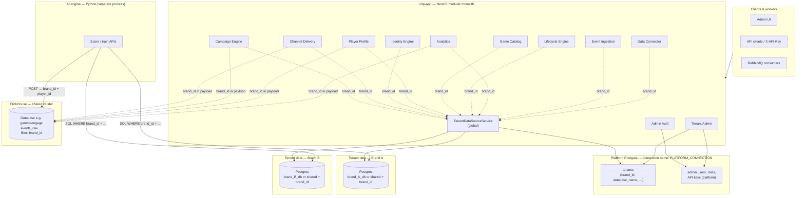
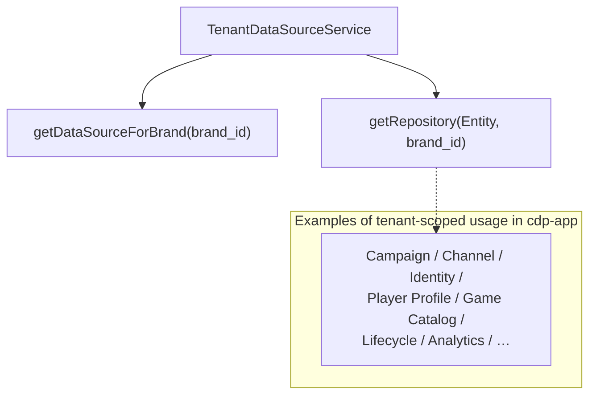
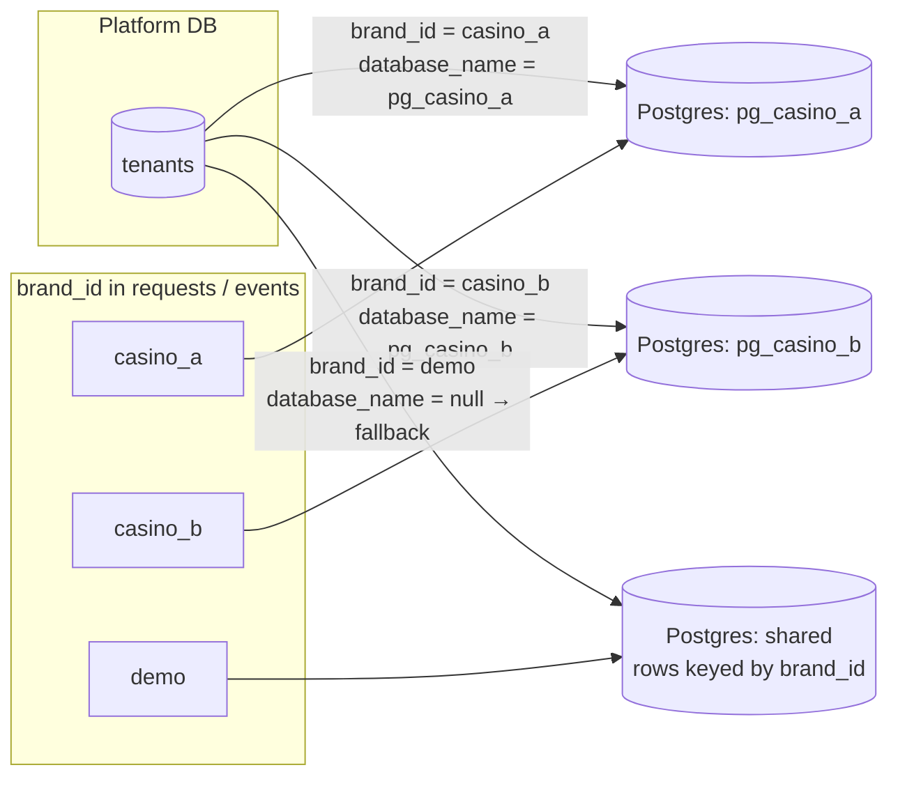

# Tenancy architecture (CDP app, platform DB, tenant DBs, AI engine)

This document explains how **brand / tenant** context flows through the system: the **modular monolith (`cdp-app`)**, the **platform Postgres** registry, **tenant Postgres** (dedicated DB per tenant or a shared database with `brand_id` on rows), **ClickHouse** (event analytics, keyed by `brand_id`), and the **AI engine** (Python service that scores players using **`brand_id`** in API and queries).

---

## 1. Big picture

**Legend**

| Piece | Role |
|--------|------|
| **TenantDataSourceService** | Looks up `tenants` by **`brand_id`**, opens the matching **Postgres** (`database_name`) or **shared fallback** DB (`TENANT_FALLBACK_DATABASE` / `DB_NAME`) where all tables share **`brand_id`** columns. |
| **Platform Postgres** | **Not** tenant business data: registry of tenants, admin-auth tables, etc. |
| **AI engine** | Not inside `cdp-app`. Uses **`brand_id`** on each request and in SQL/CH queries to isolate data logically (single DSN + `brand_id` filters is typical; dedicated DBs per brand depend on deployment). |

---

## 2. `cdp-app` feature modules (all in one process)

These are the **feature modules** imported by `AppModule` (see `cdp-app/src/app.module.ts`):

```mermaid
flowchart LR
  subgraph cdp_app["cdp-app"]
    M1["AdminAuthFeatureModule"]
    M2["TenantAdminFeatureModule"]
    M3["EventIngestionFeatureModule"]
    M4["GameCatalogFeatureModule"]
    M5["CampaignEngineFeatureModule"]
    M6["ChannelDeliveryFeatureModule"]
    M7["IdentityEngineFeatureModule"]
    M8["LifecycleEngineFeatureModule"]
    M9["PlayerProfileFeatureModule"]
    M10["AnalyticsFeatureModule"]
    M11["DataConnectorFeatureModule"]
  end
```

Shared infrastructure inside the same app:

- **TypeORM default connection** — legacy/shared tenant schema on `TENANT_FALLBACK_DATABASE` (entities listed in `TENANT_ENTITIES`).
- **`PLATFORM_CONNECTION`** — second TypeORM connection to platform DB (`PLATFORM_ENTITIES`).
- **`TenantDatabaseModule`** — provides **`TenantDataSourceService`** for **tenant-scoped** Postgres access by **`brand_id`**.

---

## 3. Who uses “tenant DB” routing (`brand_id`)?

Conceptually, services that persist or read **per-brand business data** resolve a **tenant `DataSource`** (or repository) using **`brand_id`** — either from the HTTP body/query, API key metadata, or message envelope (e.g. RabbitMQ).

**Admin Auth** and parts of **Tenant Admin** primarily use the **platform** connection (users, tenant registry), not the per-tenant data store for gameplay data.

---

## 4. Multiple tenants (illustration)

---

## 5. AI engine vs `cdp-app`

| | **cdp-app** | **AI engine** (Python) |
|---|-------------|-------------------------|
| **Deployment** | Single NestJS app, multiple feature modules | Separate HTTP service (e.g. Docker `ai-engine`) |
| **Postgres** | **`TenantDataSourceService`** + platform TypeORM | **`POSTGRES_DSN`**; queries use **`brand_id`** in SQL |
| **ClickHouse** | Various services insert/query with **`brand_id`** | Single CH database; **`brand_id`** in tables / filters |
| **Isolation** | Physical DB per tenant **or** shared DB + **`brand_id`** | Logical isolation by **`brand_id`** in queries |

---

## 6. Related code paths

- Tenant entity list: `cdp-app/src/database/tenant-entities.ts`
- Platform entity list: `cdp-app/src/database/platform-entities.ts`
- Tenant routing: `cdp-app/src/database/tenant-data-source.service.ts`
- Monolith rule: `.cursor/rules/cdp-app-monolith.mdc`

---

*Diagrams are descriptive; exact deployment (dedicated DB vs shared fallback) depends on `tenants.database_name` and environment variables.*
