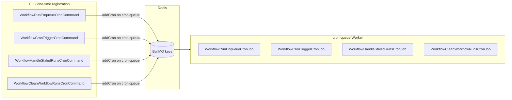
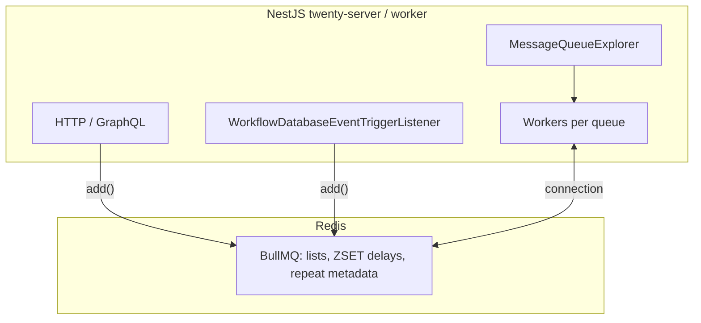
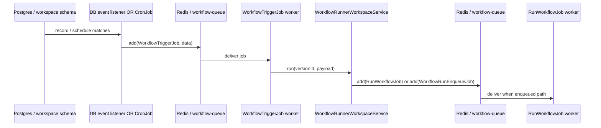
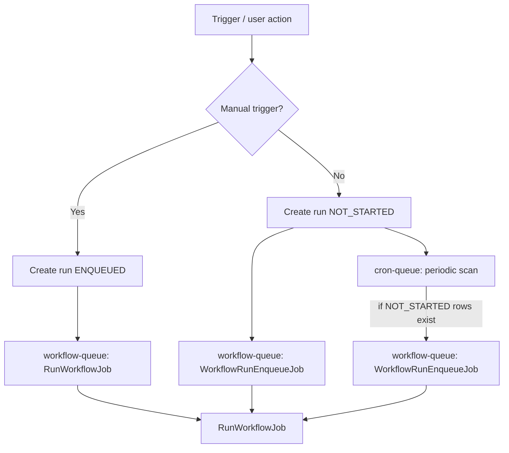
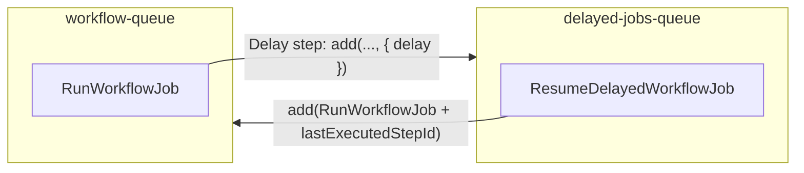
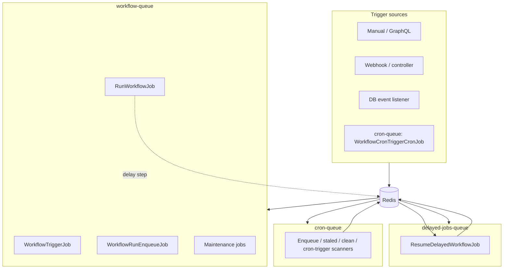

# Workflow engine: triggers, BullMQ, Redis, and queues

This document describes how **Twenty’s workflow backend** moves work from **triggers** into **BullMQ queues** backed by **Redis**, how **scheduled / repeatable** jobs are registered, and how **multiple queues** cooperate (`workflow-queue`, `cron-queue`, `delayed-jobs-queue`).

It is aimed at developers operating or porting the system. Paths are relative to `packages/twenty-server/` unless noted.

---

## 1. Building blocks

| Piece | Role |
|--------|------|
| **Redis** | Single connection (via `RedisClientService.getQueueClient()`) passed to BullMQ as `connection`. All queue state, delayed ZSETs, and repeat metadata live here. |
| **BullMQ `Queue`** | One named queue per `MessageQueue` enum value (e.g. `workflow-queue`). Producers call `queue.add(...)`. |
| **BullMQ `Worker`** | Subscribes to a queue name and runs job handlers. Twenty creates one worker per queue that has `@Processor` providers. |
| **`BullMQDriver`** | Implements register / `add` / `addCron` / `work`. See `src/engine/core-modules/message-queue/drivers/bullmq.driver.ts`. |
| **`MessageQueueService`** | Injectable bound to **one** queue name; `add` and `addCron` delegate to the driver for that queue. |
| **`MessageQueueExplorer`** | On application bootstrap, discovers classes with `@Processor`, groups them by `queueName`, and calls `messageQueueService.work()` so BullMQ **Workers** start consuming. |

**Driver factory** (`message-queue.module-factory.ts`): production uses `MessageQueueDriverType.BullMQ` with:

```ts
options: { connection: redisClientService.getQueueClient() }
```

So **every queue shares the same Redis connection options** (BullMQ namespaced by queue name).

---

## 2. Queue names (enum → BullMQ queue name)

Defined in `src/engine/core-modules/message-queue/message-queue.constants.ts`.

Workflow-related usage:

| `MessageQueue` enum | String value | Typical workflow usage |
|---------------------|---------------|-------------------------|
| `workflowQueue` | `workflow-queue` | Run workflow, trigger workflow, enqueue runs, clean runs, staled runs, workflow status batch updates |
| `cronQueue` | `cron-queue` | **Repeatable** “tick” jobs: scan workspaces for pending work, workflow cron triggers, etc. |
| `delayedJobsQueue` | `delayed-jobs-queue` | **Delayed** resume after a **Delay** step (BullMQ native `delay` option) |

Other queues exist (`email-queue`, `workspace-queue`, …) but are not the focus of this doc.

**Default job priority** for `workflow-queue` is `2` (`message-queue-priority.constant.ts`). BullMQ `add` merges `removeOnComplete` / `removeOnFail` retention and optional `delay` / `retryLimit`.

---

## 3. Producer API vs scheduling API

### One-off jobs: `MessageQueueService.add`

- Resolves to `BullMQDriver.add` → `queue.add(jobName, data, opts)`.
- Used for: `WorkflowTriggerJob`, `RunWorkflowJob`, `WorkflowRunEnqueueJob`, etc.

### Repeatable (cron-style) jobs: `MessageQueueService.addCron`

- Resolves to `BullMQDriver.addCron` → `queue.upsertJobScheduler(getJobKey(...), repeat, { name, data, opts })` (BullMQ **job scheduler** / repeatable pattern).
- CLI commands under `workflow-run-queue/cron/command/` register schedulers on **`cron-queue`**, e.g. `WorkflowRunEnqueueCronCommand` → `WorkflowRunEnqueueCronJob` every minute (`* * * * *`).



---

## 4. End-to-end architecture



- **API / listeners** enqueue jobs by name + payload.
- **Workers** (started by the explorer when the worker process boots with `JobsModule` + `MessageQueueModule.registerExplorer()`) pull jobs and invoke `@Process` methods.

---

## 5. Path A: automated triggers → `workflow-queue` → `WorkflowTriggerJob` → run

**Producers** enqueue `WorkflowTriggerJob` on **`workflow-queue`** with `{ workspaceId, workflowId, payload }`:

- **Database event**: `workflow-database-event-trigger.listener.ts` → `messageQueueService.add(WorkflowTriggerJob.name, …)` (`InjectMessageQueue(MessageQueue.workflowQueue)`).
- **Time-based (cron)**: `WorkflowCronTriggerCronJob` runs on **`cron-queue`**; when a trigger should fire, it **`add`s** `WorkflowTriggerJob` onto **`workflow-queue`**.

**Consumer**: `WorkflowTriggerJob` (`@Processor({ queueName: MessageQueue.workflowQueue })`) loads the workflow, checks published + active version, then calls `WorkflowRunnerWorkspaceService.run(...)`.



---

## 6. Path B: `WorkflowRunnerWorkspaceService.run` — two enqueue strategies

`workflow-runner.workspace-service.ts`:

1. **Manual trigger**  
   Creates a run in **`ENQUEUED`** and immediately `add(RunWorkflowJob.name, { workspaceId, workflowRunId })` on **`workflow-queue`**.

2. **Non-manual triggers** (e.g. database / webhook-style throttling path)  
   Creates a run in **`NOT_STARTED`**, bumps throttle counters, and `add(WorkflowRunEnqueueJob.name, { workspaceId, isCacheMode: true })` on **`workflow-queue`**.  
   A separate **`WorkflowRunEnqueueJob`** worker drains “not started” runs into executable state and eventually schedules `RunWorkflowJob` (see `workflow-run-enqueue.workspace-service.ts`).

**Cron assist**: `WorkflowRunEnqueueCronJob` on **`cron-queue`** runs every minute, partitions workspaces, and if any `NOT_STARTED` run exists in that workspace schema, **`add`s** `WorkflowRunEnqueueJob` on **`workflow-queue`** (`isCacheMode: false`). That covers cases where only DB state exists without an in-memory enqueue.



---

## 7. Path C: `RunWorkflowJob` (graph execution)

`RunWorkflowJob` (`workflow-runner/jobs/run-workflow.job.ts`) on **`workflow-queue`**:

- Wraps work in `GlobalWorkspaceOrmManager.executeInWorkspaceContext` + system auth.
- **Cold start**: `startWorkflowExecution` → code step build → `startWorkflowRun` → `WorkflowExecutorWorkspaceService.executeFromSteps`.
- **Resume**: `lastExecutedStepId` set → `resumeWorkflowExecution` → next steps / skip / complete.

The executor may **re-`add` the same job** with `lastExecutedStepId` after too many inline steps (`MAX_EXECUTED_STEPS_COUNT`) to avoid unbounded job duration.

---

## 8. Path D: delay step → `delayed-jobs-queue` → `workflow-queue`

**Delay** (`delay.workflow-action.ts`) does **not** block a worker thread. It:

1. Computes `delayInMs` (duration or time until scheduled date).
2. `InjectMessageQueue(MessageQueue.delayedJobsQueue)` → `add(RESUME_DELAYED_WORKFLOW_JOB_NAME, data, { delay: delayInMs })`.

BullMQ stores delayed jobs in Redis and promotes them when due.

**`ResumeDelayedWorkflowJob`** (`@Processor({ queueName: MessageQueue.delayedJobsQueue })`) runs on **`delayed-jobs-queue`**, marks the step success, then **`InjectMessageQueue(MessageQueue.workflowQueue)`** → `add(RunWorkflowJob.name, { workspaceId, workflowRunId, lastExecutedStepId })` to continue on **`workflow-queue`**.



---

## 9. Other `workflow-queue` jobs (maintenance)

| Job class | Purpose |
|-----------|---------|
| `WorkflowHandleStaledRunsJob` | Recovers stuck runs (enqueued from cron after `WorkflowHandleStaledRunsCronJob` on `cron-queue`) |
| `WorkflowCleanWorkflowRunsJob` | Retention / cleanup (cron-registered sibling pattern) |
| `WorkflowStatusesUpdateJob` | Batch workflow / version status updates from emitted events |

---

## 10. Operational checklist

1. **Redis** must be reachable with the same config used by `RedisClientService` for the queue client.
2. **Worker process** must import the same `WorkflowModule` / `JobsModule` graph as producers so `@Processor` classes are registered and `MessageQueueExplorer` attaches **Workers** to every queue name that has processors.
3. **Repeatable cron workflows** depend on **`cron-queue`** schedulers being registered (CLI `cron:workflow:*` commands in this repo).
4. **Delays** require **`delayed-jobs-queue`** workers, not only `workflow-queue`.

---

## 11. Key source files

| Topic | Location |
|--------|-----------|
| BullMQ driver | `src/engine/core-modules/message-queue/drivers/bullmq.driver.ts` |
| Queue enum | `src/engine/core-modules/message-queue/message-queue.constants.ts` |
| Worker discovery | `src/engine/core-modules/message-queue/message-queue.explorer.ts` |
| Redis → driver factory | `src/engine/core-modules/message-queue/message-queue.module-factory.ts` |
| Trigger job | `src/modules/workflow/workflow-trigger/jobs/workflow-trigger.job.ts` |
| DB listener → queue | `src/modules/workflow/workflow-trigger/automated-trigger/listeners/workflow-database-event-trigger.listener.ts` |
| Cron trigger scanner | `src/modules/workflow/workflow-trigger/automated-trigger/crons/jobs/workflow-cron-trigger-cron.job.ts` |
| Runner + enqueue | `src/modules/workflow/workflow-runner/workspace-services/workflow-runner.workspace-service.ts` |
| Run job | `src/modules/workflow/workflow-runner/jobs/run-workflow.job.ts` |
| Enqueue job + cron | `src/modules/workflow/workflow-runner/workflow-run-queue/` |
| Delay + resume | `src/modules/workflow/workflow-executor/workflow-actions/delay/` |
| Jobs module wiring | `src/engine/core-modules/message-queue/jobs.module.ts` |

---

## 12. Mental model (single diagram)



---

*This file is documentation only; behavior is authoritative in the referenced source files.*
